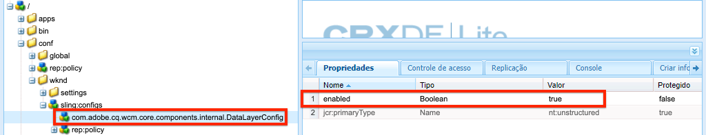

# Usando a camada de dados do cliente Adobe com os componentes principais {#data-layer-core-components}

A meta da Camada de Dados do Cliente Adobe é reduzir o esforço de instrumentar sites, fornecendo um método padronizado para expor e acessar qualquer tipo de dados para qualquer script.

A Adobe Client Data Layer é agnóstica de plataforma, mas é totalmente integrada aos Componentes principais para uso com o AEM.

Como os Componentes principais, o código da Camada de dados do cliente do Adobe está disponível no GitHub, juntamente com a documentação do desenvolvedor. Este documento fornece uma visão geral de como os Componentes principais interagem com a Camada de dados, mas detalhes técnicos completos são adiados para a documentação do GitHub.

>[!TIP]
>
>Para obter mais informações sobre a Camada de dados do cliente Adobe, [consulte os recursos em seu repositório GitHub.](https://github.com/adobe/adobe-client-data-layer)
>
>Para obter mais detalhes técnicos sobre a integração da Camada de dados do cliente Adobe com os componentes principais, consulte o [`DATA_LAYER_INTEGRATION.md`](https://github.com/adobe/aem-core-wcm-components/blob/master/DATA_LAYER_INTEGRATION.md) arquivo no repositório dos componentes principais.

## Instalação e Ativação {#installation-activation}

A partir da versão 2.9.0 dos Componentes principais, a Camada de dados é distribuída com os Componentes principais como uma Biblioteca de clientes AEM e nenhuma instalação é necessária. Todos os projetos gerados pelo [AEM Project Archetype v. 24+](/help/developing/archetype/overview.md) incluem uma Camada de Dados ativada por padrão.

Para ativar manualmente a Camada de Dados, é necessário criar uma configuração [sensível ao](/help/developing/context-aware-configs.md) contexto para ela:

1. Crie a seguinte estrutura abaixo da `/conf/<mySite>` pasta, onde `<mySite>` é o nome do projeto de seu Site:
   * `/conf/<mySite>/sling:configs/com.adobe.cq.wcm.core.components.internal.DataLayerConfig`
   * Onde cada nó tem um `jcr:primaryType` definido como `nt:unstructured`.
1. Adicione uma propriedade booleana chamada `enabled` e defina-a como `true`.

   

   *Localização de DataLayerConfig no Site de Referência WKND*

1. Adicione uma `sling:configRef` propriedade ao `jcr:content` nó do site abaixo `/content` (por exemplo, `/content/<mySite>/jcr:content`) e defina-a como `/conf/<mySite>` da etapa anterior.

1. Depois de ativada, você pode verificar a ativação carregando uma página do site fora do editor. A origem da página e a `<body>` tag do Inspect devem incluir um atributo `data-cmp-data-layer-enabled`

   ```html
   <body class="page basicpage" id="page-id" data-cmp-data-layer-enabled>
       <script>
         window.adobeDataLayer = window.adobeDataLayer || [];
         adobeDataLayer.push({
             page: JSON.parse("{\x22page\u002D6c5d4b9fdd\x22:{\x22xdm:language\x22:\x22en\x22,\x22repo:path\x22:\x22\/content\/wknd\/language\u002Dmasters\/en.html\x22,\x22xdm:tags\x22:[],\x22xdm:template\x22:\x22\/conf\/wknd\/settings\/wcm\/templates\/landing\u002Dpage\u002Dtemplate\x22,\x22@type\x22:\x22wknd\/components\/page\x22,\x22dc:description\x22:\x22WKND is a collective of outdoors, music, crafts, adventure sports, and travel enthusiasts that want to share our experiences, connections, and expertise with the world.\x22,\x22dc:title\x22:\x22WKND Adventures and Travel\x22,\x22repo:modifyDate\x22:\x222020\u002D09\u002D29T07:50:13Z\x22}}"),
             event:'cmp:show',
             eventInfo: {
                 path: 'page.page\u002D6c5d4b9fdd'
             }
         });
       </script>
   ```

1. Você também pode abrir as ferramentas do desenvolvedor do seu navegador e, no console, o objeto `adobeDataLayer` JavaScript deve estar disponível. Digite o seguinte comando para obter o estado da Camada de dados da sua página atual:

   ```js
   window.adobeDataLayer.getState();
   ```

## Schemas de dados dos componentes principais {#data-schemas}

A seguir está uma lista de schemas que os Componentes principais usam com a Camada de dados.

### Schema de componente/item de Container {#item}

O schema de componente/item de Container é usado nos seguintes componentes:

* [Caminho](/help/components/breadcrumb.md)
* [Botão](/help/components/button.md)
* [Navegação de idiomas](/help/components/language-navigation.md)
* [Lista](/help/components/list.md)
* [Navegação](/help/components/navigation.md)
* [Teaser](/help/components/teaser.md)
* [Texto](/help/components/text.md)
* [Título](/help/components/title.md)

O schema de componente/item de Container é definido da seguinte forma.

```javascript
id: {                   // component ID
    @type               // resource type
    repo:modifyDate     // last modified date
    dc:title            // title
    dc:description      // description
    xdm:text            // text
    xdm:linkURL         // link URL
    parentId            // parent component ID
}
```

O seguinte [evento](#events) é relevante para o schema Componente/Item do Container:

* `cmp:click`

### Schema da página {#page}

O schema Página é usado pelo seguinte componente:

* [Página](/help/components/page.md)

O schema Página é definido da seguinte maneira.

```javascript
id: {
    @type
    repo:modifyDate
    dc:title
    dc:description
    xdm:text
    xdm:linkURL
    parentId
    xdm:tags            // page tags
    repo:path           // page path
    xdm:template        // page template
    xdm:language        // page language
}
```

Um `cmp:show` evento é acionado no carregamento da página. Esse evento é despachado do JavaScript em linha imediatamente abaixo da `<body>` tag de abertura, tornando-o o evento mais antigo na fila de evento da camada de dados.

### Schema container {#container}

O schema do Container é usado pelos seguintes componentes:

* [Menu sanfonado](/help/components/accordion.md)
* [Guias](/help/components/tabs.md)
* [Carrossel](/help/components/carousel.md)

O schema do Container é definido como a seguir.

```javascript
id: {
    @type
    repo:modifyDate
    dc:title
    dc:description
    xdm:text
    xdm:linkURL
    parentId
    shownItems          // array of the displayed item IDs
}
```

Os seguintes [eventos](#events) são relevantes para o schema do Container:

* `cmp:click`
* `cmp:show`
* `cmp:hide`

### Schema de imagem {#image}

O schema de imagem é usado pelo seguinte componente:

* [Imagem](/help/components/image.md)

O schema de imagem é definido da seguinte forma:

```javascript
id: {
    @type
    repo:modifyDate
    dc:title
    dc:description
    xdm:text
    xdm:linkURL
    parentId
    image               // asset detail (see below section)
}
```

O seguinte [evento](#events) é relevante para o schema de imagem:

* `cmp:click`

### Schema de ativos {#asset}

O schema Asset é usado dentro do componente [Image.](/help/components/image.md)

O schema Asset é definido como a seguir.

```javascript
id: {
    repo:id             // asset UUID
    repo:path           // asset path
    @type               // asset resource type
    xdm:tags            // asset tags
    repo:modifyDate
}
```

O seguinte [evento](#events) é relevante para o schema de ativos:

* `cmp:click`

## Eventos componentes principais {#events}

Há vários eventos que os Componentes principais acionam por meio da Camada de dados. A prática recomendada para interagir com a Camada de dados é [registrar um ouvinte](https://github.com/adobe/adobe-client-data-layer/wiki#addeventlistener) de eventos e *depois* executar uma ação com base no tipo de evento e/ou componente que acionou o evento. Isso evitará possíveis condições de raça com scripts assíncronos.

Abaixo estão os eventos prontos para uso fornecidos pelos componentes principais AEM:

* **`cmp:click`** - Clicar em um elemento clicável (um elemento que tem um `data-cmp-clickable` atributo) faz com que a camada de dados dispare um `cmp:click` evento.
* **`cmp:show`** e **`cmp:hide`** - Manipular o acordeão (expandir/recolher), o carrossel (botões próximo/anterior) e os componentes de guias (seleção de guia) fazem com que a camada de dados seja acionada `cmp:show` e um `cmp:hide` evento, respectivamente. Um `cmp:show` evento também é despachado no carregamento da página e espera-se que seja o primeiro evento.
* **`cmp:loaded`** - Assim que a Camada de dados for preenchida com os Componentes principais na página, a Camada de dados acionará um `cmp:loaded` evento.

### Eventos acionados pelo componente {#events-components}

As tabelas a seguir listas os Componentes principais padrão que acionam eventos junto com esses eventos.

| Componente | Evento(s) |
|---|---|
| [Menu sanfonado](/help/components/accordion.md) | `cmp:show` e `cmp:hide` |
| [Botão](/help/components/button.md) | `cmp:click` |
| [Caminho](/help/components/breadcrumb.md) | `cmp:click` |
| [Carrossel](/help/components/carousel.md) | `cmp:show` e `cmp:hide` |
| [Navegação de idiomas](/help/components/language-navigation.md) | `cmp:click` |
| [Navegação](/help/components/navigation.md) | `cmp:click` |
| [Página](/help/components/page.md) | `cmp:show` |
| [Guias](/help/components/tabs.md) | `cmp:show` e `cmp:hide` |
| [Teaser](/help/components/teaser.md) | `cmp:click` |

### Informações do caminho do evento {#event-path-info}

Cada evento de camada de dados acionado por um componente principal AEM incluirá uma carga com o seguinte objeto JSON:

```json
eventInfo: {
    path: '<component-path>'
}
```

Onde `<component-path>` é o caminho JSON para o componente na Camada de dados que acionou o evento.  O valor, disponível via `event.eventInfo.path`, é importante, pois pode ser usado como um parâmetro para o `adobeDataLayer.getState(<component-path>)` qual recupera o estado atual do componente que acionou o evento, permitindo que o código personalizado acesse dados adicionais e os adicione à Camada de dados.

Por exemplo:

```js
function logEventObject(event) {
    if(event.hasOwnProperty("eventInfo") && event.eventInfo.hasOwnProperty("path")) {
        var dataObject = window.adobeDataLayer.getState(event.eventInfo.path);
        console.debug("The component that triggered this event: ");
        console.log(dataObject);
    }
}

window.adobeDataLayer = window.adobeDataLayer || [];
window.adobeDataLayer.push(function (dl) {
     dl.addEventListener("cmp:show", logEventObject);
});
```

## Tutorial

Deseja explorar a camada de dados e os componentes principais com mais detalhes? [Dê uma olhada neste tutorial](https://docs.adobe.com/content/help/en/experience-manager-learn/sites/integrations/adobe-client-data-layer/data-layer-overview.html)prático.
