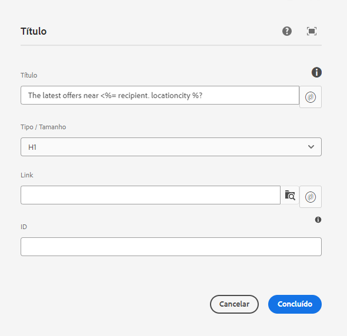

# Variáveis de campanha {#campaign-variables}

Use variáveis de campanha para compor conteúdo de email personalizado. As variáveis de campanha atuam como marcadores de posição para valores do Adobe Campaign que podem ser inseridos no conteúdo do seu email. Quando o conteúdo é enviado via Adobe Campaign, o Campaign substitui essas variáveis pelo conteúdo personalizado do recipient.

## Uso {#usage}

Os Componentes principais de email tornam variáveis da campanha facilmente acessíveis por meio de botões de personalização ao lado de campos de texto comuns. Quando pressionada, uma caixa de diálogo é exibida e pode-se selecionar um campo de personalização.

A lista de campos de personalização disponíveis é sincronizada com a instância do Adobe Campaign. Os campos são gerenciados no Adobe Campaign no schema `nms:seedMember`. Todos os campos em `nms:seedMember` também deve estar presente na tabela de recipients.

## Caixa de diálogo Selecionar variável do Adobe Campaign {#dialog}

A caixa de diálogo Selecionar variável do Adobe Campaign está disponível em várias caixas de diálogo de edição dos Componentes principais de email. Para usá-lo, basta clicar no botão **Selecionar variável Adobe Campaign** ícone ao lado do campo aplicável. Esse ícone pode assumir duas formas.

Clicar em ambos os ícones abre o **Selecionar variável Adobe Campaign** caixa de diálogo.

Use a exibição de coluna para localizar a variável que deseja inserir. Clicar em um nó em uma coluna mostra seus filhos em uma nova coluna à direita. Dessa forma, você pode navegar pela estrutura de conteúdo variável.

Selecione a variável que deseja inserir e clique na marca de seleção na parte superior direita da caixa de diálogo.

A variável é inserida no campo da caixa de diálogo de edição do Componente principal de email.

Clique no X na parte superior esquerda da caixa de diálogo a qualquer momento para cancelar e fechar a caixa de diálogo.
