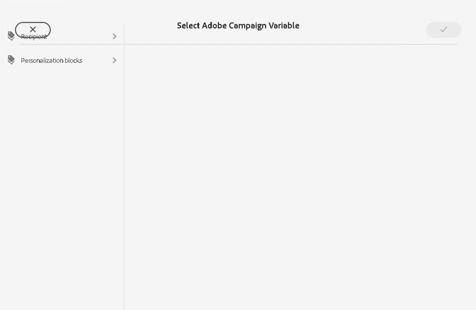
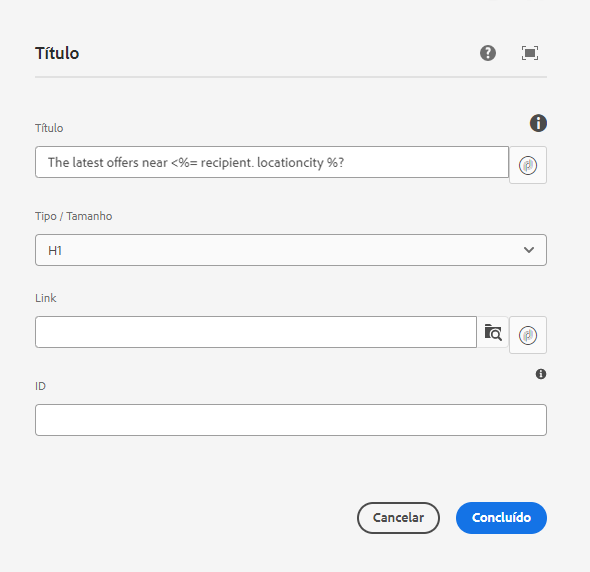

# Variáveis de campanha {#campaign-variables}

Use variáveis de campanha para compor um conteúdo de email personalizado. As variáveis de campanha atuam como espaços reservados para valores do Adobe Campaign que podem ser inseridos no conteúdo do seu email. Quando o conteúdo é enviado por meio do Adobe Campaign, o Campaign substitui essas variáveis pelo conteúdo personalizado do destinatário.

## Uso {#usage}

Os Componentes principais de email facilitam o acesso às variáveis de campanha por meio de botões de personalização, localizados ao lado dos campos de texto comuns. Quando pressionados, uma caixa de diálogo é exibida, na qual é possível selecionar um campo de personalização.

A lista de campos de personalização disponíveis é sincronizada com a instância do Adobe Campaign. Os campos são gerenciados no Adobe Campaign no esquema `nms:seedMember`. Todos os campos no `nms:seedMember` também devem estar presentes na tabela de destinatários.

## Caixa de diálogo Selecionar variável do Adobe Campaign {#dialog}

A caixa de diálogo Selecionar variável do Adobe Campaign está disponível em várias caixas de diálogo de edição dos Componentes principais de email. Para usá-la, basta clicar no ícone **Selecionar variável Adobe Campaign** ao lado do campo aplicável. Esse ícone pode ter duas formas.

Clicar em ambos os ícones abre a caixa de diálogo **Selecionar variável do Adobe Campaign**.

Use a exibição de coluna para localizar a variável que deseja inserir. Clicar em um nó em uma coluna mostra os filhos em uma nova coluna à direita. Dessa forma, você pode navegar pela estrutura de conteúdo de variáveis.

Selecione a variável que deseja inserir e clique na marca de seleção na parte superior direita da caixa de diálogo.

A variável é inserida no campo da caixa de diálogo de edição do Componente principal de email.

Clique no X na parte superior esquerda da caixa de diálogo a qualquer momento para cancelar e fechar a caixa de diálogo.
