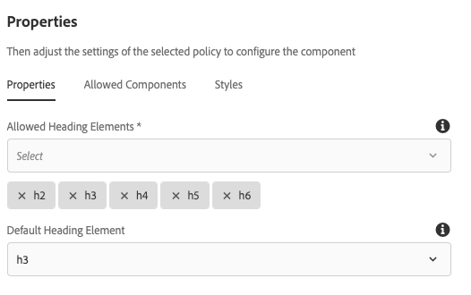

# Componente Acordeão{#accordion-component}

O componente principal Acordeão de componentes permite a criação de uma coleção de painéis organizados em um acordeão em uma página.

## Uso {#usage}

O componente principal Acordeão de componentes permite a criação de uma coleção de componentes, composta como painéis, e organizada de acordo com uma tabela em uma página, semelhante ao Componente [de](tabs.md)guias, mas permite expandir e recolher os painéis.

* As propriedades do acordeão podem ser definidas na caixa de diálogo configurar.
* A ordem dos painéis do acordeão pode ser definida na caixa de diálogo de configuração, bem como no pod de painel [selecionado](#select-planel.md).
* Os padrões do Componente Acordeão ao adicioná-lo a uma página podem ser definidos na caixa de diálogo de design.

## Versão e compatibilidade {#version-and-compatibility}

A versão atual do Componente Acordeão é v1, que foi introduzida com a versão 2.5.0 dos Componentes Principais em junho de 2019, e é descrita neste documento.

A tabela a seguir detalha todas as versões compatíveis do componente, as versões do AEM com as quais as versões do componente são compatíveis e os links para a documentação de versões anteriores.

| Versão do componente | AEM 6.3 | AEM 6.4 | AEM 6.5 |
|--- |--- |--- |---|
| v1 | Compatível | Compatível | Compatível |

Para obter mais informações sobre versões e versões dos Componentes principais, consulte o documento Versões [dos componentes](versions.md)principais.

## Exemplo de saída de componente {#sample-component-output}

Para experimentar o componente Acordeão, bem como ver exemplos de suas opções de configuração, bem como a saída HTML e JSON, visite a Biblioteca [de](http://opensource.adobe.com/aem-core-wcm-components/library/accordion.html)componentes.

## Detalhes técnicos {#technical-details}

A documentação técnica mais recente sobre o componente Acordeão [pode ser encontrada no GitHub](https://github.com/adobe/aem-core-wcm-components/tree/master/content/src/content/jcr_root/apps/core/wcm/components/accordion/v1/accordion).

Para obter mais detalhes sobre o desenvolvimento dos Componentes principais, consulte a documentação [do desenvolvedor dos Componentes](developing.md)principais.

## Configurar caixa de diálogo {#configure-dialog}

A caixa de diálogo de configuração permite que o autor do conteúdo defina o item acordeão, seus painéis e como ele se comportará e aparecerá para um visitante da página.

### Guia Itens {#items-tab}

Use o botão **Adicionar** para abrir o seletor de componentes e escolher qual componente adicionar como painel. Depois de adicionada, uma entrada é adicionada à lista, que contém as seguintes colunas:

* **Ícone** - o ícone do tipo de componente do painel para facilitar a identificação na lista. Passe o mouse sobre o mouse para ver o nome completo do componente como uma dica de ferramenta.
* **Descrição** - A descrição usada como o texto do painel, padronizando com o nome do componente selecionado para o painel.
* **Excluir** - Toque ou clique para excluir o painel do componente acordeão.
* **Reorganizar** - Toque ou clique e arraste para reorganizar a ordem dos painéis.

### Guia Propriedades {#properties-tab}

* **Expansão** de um único item - Quando selecionada, essa opção força um único item de acordeão a ser expandido de cada vez. Expandir um item recolherá todos os outros.
* **Itens** expandidos - Essa opção define os itens que são expandidos por padrão quando a página é carregada.
   * Quando a opção Expansão **de item** único é selecionada, um painel deve ser selecionado. Por padrão, o primeiro painel é selecionado.
   * Quando a expansão **de item** único não está selecionada, essa opção é de seleção múltipla e é opcional.

## Selecionar Pop-ver do Painel {#seelct-panel-popover}

O autor do conteúdo pode usar a opção **Selecionar painel** na barra de ferramentas do componente para mudar para um painel diferente para edição, bem como para reorganizar facilmente a ordem dos painéis dentro do acordeão.

Depois de selecionar a opção **Selecionar painel** na barra de ferramentas do componente, os painéis de acordeão configurados são exibidos como um menu suspenso.

* A lista é ordenada pela organização atribuída aos painéis e é refletida na numeração.
* O tipo de componente do painel é exibido primeiro, seguido pela descrição do painel em fonte mais clara.
* Tocar ou clicar em uma entrada na lista suspensa alterna a visualização no editor para esse painel.
* Os painéis podem ser reorganizados no local usando as alças de arrastar.

## Caixa de diálogo Design {#design-dialog}

A caixa de diálogo de design permite que o autor do modelo defina as opções disponíveis para o autor do conteúdo que usa o Componente Acordeão e os padrões definidos ao colocar o Componente Acordeão.

### Guia Propriedades {#properties-tab-design}

* **Elementos** de cabeçalho permitidos - essa lista suspensa de seleção múltipla define o cabeçalho do item de acordeão elementos HTML que podem ser selecionados por um autor.
* **Elemento** de cabeçalho padrão - Essa lista suspensa define o elemento HTML de cabeçalho do item de acordeão padrão.

### Guia Componentes permitidos {#allowed-components-tab}

A guia Componentes **** permitidos é usada para definir quais componentes podem ser adicionados como itens aos painéis no Componente Acordeão pelo autor do conteúdo.

A guia Componentes permitidos funciona da mesma maneira que a guia do mesmo nome ao [definir a política e as propriedades de um Contêiner de layout no Editor de modelos.](https://helpx.adobe.com/experience-manager/6-5/sites/authoring/using/templates.html)

### Guia Estilos {#styles-tab}

O componente Acordeão suporta o AEM [Style System](authoring.md#component-styling).
