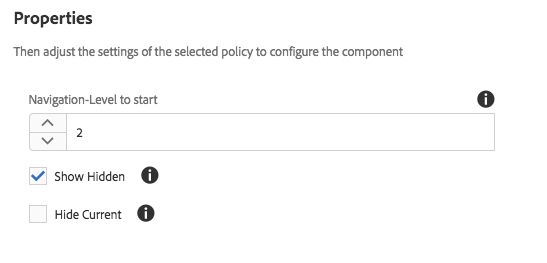

# Componente da trilha de navegação (v 1){#breadcrumb-component-v}

O componente de navegação estrutural do componente principal é um componente de navegação que cria uma navegação estrutural de links com base no local da página na hierarquia de conteúdo.

## Uso {#usage}

O componente de navegação estrutural exibe a posição da página atual na hierarquia do site, permitindo que os visitantes da página naveguem pela hierarquia da página a partir do seu local atual. Isso é frequentemente integrado aos cabeçalhos de página ou rodapés.

Opções disponíveis como o nível de navegação padrão e a capacidade de mostrar a página atual ou as páginas ocultas podem ser definidas pelo autor do modelo na caixa de diálogo [de design](breadcrumb-v1.md#main-pars_title_1995166862). O editor de conteúdo pode então escolher se páginas ocultas devem ser exibidas ou não e o nível de navegação real do componente na janela [de edição](breadcrumb-v1.md#main-pars_title).

## Versão e compatibilidade {#version-and-compatibility}

Este documento descreve a v 1 do componente de navegação estrutural, originalmente introduzido com a versão 1.0.0 dos componentes principais com o AEM 6.3.

A tabela a seguir lista a compatibilidade da v 1 do componente de navegação estrutural.

| Versão do AEM | Breadcrumb Component v 1 |
|--- |--- |
| 6.3 | Compatível |
| 6.4 | Compatível |

>[!CAUTION]
>
>Este documento descreve v 1 do componente de navegação estrutural.
>Para obter detalhes sobre a versão atual do componente de navegação estrutural, consulte o documento [Componente](breadcrumb.md) da trilha de navegação.

## Exemplo de saída do componente {#sample-component-output}

A amostra a seguir é coletada em [We. Retail](https://helpx.adobe.com/experience-manager/6-4/sites/developing/using/we-retail.html).

### Captura de tela {#screenshot}


### HTML {#html}

```
<div class="cmp cmp-breadcrumb aem-GridColumn aem-GridColumn--default--12">

<ol class="breadcrumb">
    <li class="breadcrumb-item ">
        <a href="/content/we-retail/us.html">
            United States
        </a>
    </li>

    <li class="breadcrumb-item ">
        <a href="/content/we-retail/us/en.html">
            English
        </a>
    </li>

    <li class="breadcrumb-item active">
        
            Experience
        
    </li>
</ol>
 
</div>
```

### JSON {#json}

```
"breadcrumb": {
              "columnClassNames": "aem-GridColumn aem-GridColumn--default--12",
              ":type": "weretail/components/content/breadcrumb"
            }
```

>[!NOTE]
>
>A exportação JSON dos componentes principais requer a versão 1.1.0 dos Componentes principais. Consulte as [informações de compatibilidade para Componentes principais v 1](versions.md#main-pars_title_236368006) para obter mais informações.

## Editar caixa de diálogo {#edit-dialog}

A caixa de diálogo Editar permite que o autor do conteúdo exclua páginas ocultas e ativas nas navegações estruturais, bem como a profundidade na hierarquia que ela deve ser exibida.


* **Nível de navegação para iniciar** - onde na hierarquia o componente da trilha de navegação deve começar a navegar até a página atual. Por exemplo, em We. Retail:

   * 1 inicia em `/content/we-retail`
   * 2 inicia em `/content/we-retail/<country>`

* **Mostrar oculto** - Mostrar páginas marcadas como ocultas na navegação estrutural (por padrão, elas não serão exibidas)
* **Ocultar a atual**- A página atual na navegação estrutural (por padrão, será exibida)

## Caixa de diálogo de design {#design-dialog}

A caixa de diálogo de design permite que o autor do modelo defina o que os valores padrão são para as opções de suprimir páginas ocultas e ativas nas navegações estruturais, bem como a profundidade na hierarquia que ela deve ser exibida.



* **Nível de navegação para iniciar** - define o valor padrão para onde, na hierarquia, o componente da trilha de navegação deve começar para se movimentar até a página atual quando o componente da navegação estrutural é adicionado a uma página.
* **Mostrar Oculto** - define o valor padrão da opção **Mostrar oculta** quando o componente de navegação estrutural é adicionado a uma página.

   * Isso não ativa ou desativa a opção para o autor. Ela apenas define o valor padrão.

* **Ocultar atual** - define o valor padrão da opção **Ocultar atual** quando o componente de navegação estrutural é adicionado a uma página.

   * Isso não ativa ou desativa a opção para o autor. Ela apenas define o valor padrão.

## Detalhes técnicos {#technical-details}

A documentação técnica mais recente sobre o componente de navegação estrutural [pode ser encontrada no github](https://github.com/adobe/aem-core-wcm-components/tree/master/content/src/content/jcr_root/apps/core/wcm/components/breadcrumb/v1/breadcrumb).

Todo o projeto de componentes principais pode ser baixado de github.

Detalhes adicionais sobre o desenvolvimento dos Componentes principais podem ser encontrados na documentação do desenvolvedor de Componentes [principais](developing.md).
