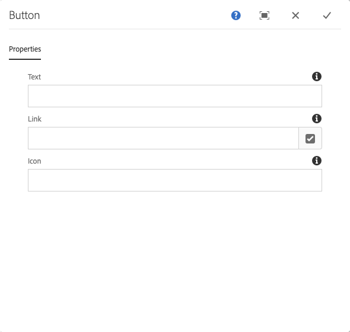

# Button Component{#button-component}

O componente do botão de componente principal permite a configuração e a exibição de um item de botão em uma página.

## Uso {#usage}

O componente de botão do componente principal permite a inclusão de um botão em uma página.

* The button&#39;s properties can be selected in the [configure dialog](#configure-dialog).
* Styles for the Button Component can be defined in the [design dialog](#design-dialog).

## Version and Compatibility {#version-and-compatibility}

A versão atual do componente de Botão é v 1, que foi introduzida com a versão 2.5.0 dos Componentes principais em junho de 2019 e descrita neste documento.

A tabela a seguir detalha todas as versões compatíveis do componente, as versões AEM com as quais as versões do componente são compatíveis e links para a documentação das versões anteriores.

| Versão do componente | AEM 6.3 | AEM 6.4 | AEM 6.5 |
|--- |--- |--- |---|
| v1 | Compatível | Compatível | Compatível |

For more information about Core Component versions and releases, see the document [Core Components Versions](versions.md).

## Sample Component Output {#sample-component-output}

To experience the Button Component as well as see examples of its configuration options as well as HTML and JSON output, visit the [Component Library](http://opensource.adobe.com/aem-core-wcm-components/library/button.html).

## Technical Details {#technical-details}

The latest technical documentation about the Button Component [can be found on GitHub](https://github.com/adobe/aem-core-wcm-components/tree/master/content/src/content/jcr_root/apps/core/wcm/components/button/v1/button).

Further details about developing Core Components can be found in the [Core Components developer documentation](developing.md).

## Configure Dialog {#configure-dialog}

A caixa de diálogo Configurar permite que o autor do conteúdo defina o botão e como ele se comportará e será exibido para um visitante da página.

* **Texto** - O texto a ser exibido no botão
* **Link** - Link para uma página de conteúdo no AEM, um recurso externo ou uma âncora
   * Use the **Selection Dialog** to choose a path within AEM.
* **Ícone** - Identificador para exibir um ícone no botão

## Design Dialog {#design-dialog}

### Styles Tab {#styles-tab}

The Image Component supports the AEM [Style System](authoring.md#component-styling).
