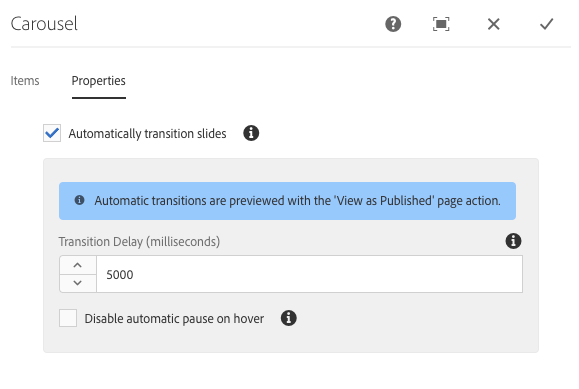

# Componente do carrossel{#carousel-component}

O componente do carrossel principal permite que o autor do conteúdo apresente conteúdo em um carrossel navegável.

## Uso {#usage}

Usando o componente do carrossel, o autor do conteúdo para organizar o conteúdo em um carrossel giratório de slides.

A caixa de diálogo [Editar](#edit-dialog) permite que o autor do conteúdo crie, nomeie e ordene vários slides, além de habilitar a transição automática com atraso. Usando a [caixa de diálogo de design](#design-dialog), o autor do modelo pode definir quais componentes podem ser adicionados ao carrossel, ativar ou desativar transições automáticas e personalizar os estilos.

## Versão e compatibilidade {#version-and-compatibility}

A versão atual do componente carrossel é v 1, que foi introduzida com a versão 2.2.0 dos Componentes principais em outubro de 2018 e descrita neste documento.

A tabela a seguir detalha todas as versões compatíveis do componente, as versões AEM com as quais as versões do componente são compatíveis e links para a documentação das versões anteriores.

| Versão do componente | AEM 6.3 | AEM 6.4 | AEM 6.5 |
|--- |--- |--- |--- |
| v1 | Compatível | Compatível | Compatível |

Para obter mais informações sobre versões e versões do componente principal, consulte o documento [Principais versões de componentes](versions.md).

## Exemplo de saída do componente {#sample-component-output}

A seguir está uma amostra tirada de [We. Retail](https://helpx.adobe.com/experience-manager/6-5/sites/developing/using/we-retail.html).

### Captura de tela {#screenshot}

### Biblioteca de componentes {#component-library}

Para experimentar o componente carrossel, bem como ver exemplos de suas opções de configuração, além de HTML e saída JSON, visite a Biblioteca [de componentes](http://opensource.adobe.com/aem-core-wcm-components/library/carousel.html).

### Detalhes técnicos {#technical-details}

A documentação técnica mais recente sobre o componente carrossel [pode ser encontrada no github](https://github.com/adobe/aem-core-wcm-components/blob/master/content/src/content/jcr_root/apps/core/wcm/components/carousel/v1/carousel).

Detalhes adicionais sobre o desenvolvimento dos Componentes principais podem ser encontrados na documentação do desenvolvedor de Componentes [principais](developing.md).

## Editar caixa de diálogo {#edit-dialog}

A caixa de diálogo Editar permite que o autor do conteúdo adicione, renomeie e reorganize slides, bem como defina as configurações de transição automática.

### Guia Itens {#items-tab}

Use o botão **Adicionar** para abrir o seletor de componentes para escolher qual componente adicionar como uma guia. Uma vez adicionada, uma entrada é adicionada à lista, que contém as seguintes colunas:

* **Ícone** - O ícone do tipo de componente da guia para fácil identificação na lista. Passe o mouse sobre o nome completo do componente como uma dica de ferramenta.
* **Descrição** - A descrição usada como o texto da guia, padrão do nome do componente selecionado para a guia.
* **Excluir** - toque ou clique para excluir a guia do componente tabulações.
* **Reordenar** - toque ou clique e arraste para ordenar as guias.

### Guia Propriedades {#properties-tab}

Na guia **Propriedades** , o autor do conteúdo pode definir os slides para a transição automática.

* **Slides de transição automaticamente** - quando ativo, o componente avança automaticamente para o próximo slide após um atraso especificado.
* **Atraso de transição** - Quando os slides de transição automaticamente são selecionados, esse valor é usado para definir o atraso entre as transições (em milissegundos).
* **Desativar pausa automática ao passar o mouse** - quando **os slides de transição automaticamente** são selecionados, a transição do carrossel automaticamente pausa sempre que o cursor passa sobre o carrossel. Selecione esta opção para que a transição não pause.

>[!NOTE]
>
>Os controles de avanço de slide não são ativados no modo **de Edição** . Use [**o modo de Visualização**](https://helpx.adobe.com/experience-manager/6-5/sites/authoring/using/editing-content.html) ou **[a](https://helpx.adobe.com/experience-manager/6-5/sites/authoring/using/editing-content.html)** opção Exibir como publicada para interagir com o carrossel como um leitor do conteúdo publicado.
>
>O recurso de avanço automático não está ativado no modo **de Edição** . Use **[a opção Exibir como publicada](https://helpx.adobe.com/experience-manager/6-5/sites/authoring/using/editing-content.html)** para ver o recurso de avanço automático como um leitor do conteúdo publicado.

## Selecionar painel {#select-panel}

O autor do conteúdo pode usar a **opção Selecionar painel** na barra de ferramentas do componente para mudar para um slide diferente para edição, bem como para reorganizar a ordem dos slides facilmente.

Depois de selecionar a **opção Selecionar painel** na barra de ferramentas do componente, os slides configurados são exibidos como um menu suspenso.

* A lista é ordenada pela disposição atribuída dos slides e refletida na numeração.
* O tipo de componente do slide é exibido primeiro, seguido pela descrição do slide na fonte mais leve.

* Tocar ou clicar em uma entrada na lista suspensa, alterna a exibição no editor para esse slide.
* O slide pode ser reordenado no local usando as alças de arrastar.

## Caixa de diálogo de design {#design-dialog}

A caixa de diálogo de design permite que o autor do modelo defina quais componentes podem ser adicionados como slides para o componente do carrossel, bem como definir padrões de transição automática e quais estilos personalizados estão disponíveis para o autor do conteúdo.

### Guia Propriedades {#properties-tab-1}

A guia **Propriedades** é usada para definir as configurações padrão das transições de slides quando um autor de conteúdo adiciona o componente de carrossel a uma página.

* **Automaticamente de transição** - define se, por padrão, a opção para mover automaticamente o carrossel para o próximo slide é ativada quando o autor do conteúdo adiciona o componente de carrossel a uma página.
* **Atraso de transição** - define o valor padrão do atraso de transição entre slides (em milissegundos) quando um autor de conteúdo adiciona o componente de carrossel a uma página.
* **Desativar pausa automática ao passar o mouse** - define se por padrão a opção para desativar a pausa automática de slide está ativada quando **os slides de transição automática** são selecionados pelo autor do conteúdo.

### Guia Componentes permitidos {#allowed-components-tab}

A guia **Componentes** permitidos é usada para definir quais componentes podem ser adicionados como slides para o Componente carrossel pelo autor do conteúdo.

As funções de guia Componentes permitidos da mesma forma que a guia com o mesmo nome ao [definir a política e as propriedades de um Contêiner de layout no Editor de modelos.](https://helpx.adobe.com/experience-manager/6-5/sites/authoring/using/templates.html)

### Guia Estilos {#styles-tab}

O componente carrossel é compatível com o sistema [de estilo do AEM](authoring.md#component-styling).