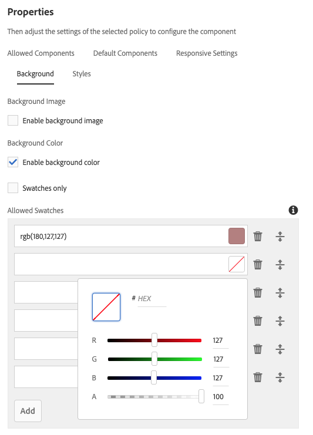

# Componente do contêiner{#container-component}

O componente principal do contêiner de componentes permite a criação de um contêiner para vários componentes adicionais em uma página.

## Uso {#usage}

O componente principal do contêiner de componentes permite a criação de um contêiner para vários componentes adicionais em uma página e pode ser usado para agrupar outros componentes e aplicar um estilo ou layout comum.

* As propriedades do contêiner podem ser selecionadas na caixa de diálogo configurar.
* Os padrões do Componente de contêiner ao adicioná-lo a uma página podem ser definidos na caixa de diálogo [de](#design-dialog)design.

## Versão e compatibilidade {#version-and-compatibility}

A versão atual do Componente de contêiner é a v1, que foi introduzida com a versão 2.5.0 dos Componentes principais em junho de 2019, e é descrita neste documento.

A tabela a seguir detalha todas as versões compatíveis do componente, as versões do AEM com as quais as versões do componente são compatíveis e os links para a documentação de versões anteriores.

| Versão do componente | AEM 6.3 | AEM 6.4 | AEM 6.5 |
|--- |--- |--- |---|
| v1 | Compatível | Compatível | Compatível |

Para obter mais informações sobre versões e versões dos Componentes principais, consulte o documento Versões [dos componentes](versions.md)principais.

## Exemplo de saída de componente {#sample-component-output}

Para experimentar o Componente do contêiner e ver exemplos de suas opções de configuração, bem como a saída HTML e JSON, visite a Biblioteca [de](http://opensource.adobe.com/aem-core-wcm-components/library/container.html)componentes.

## Detalhes técnicos {#technical-details}

A documentação técnica mais recente sobre o componente de contêiner [pode ser encontrada no GitHub](https://github.com/adobe/aem-core-wcm-components/tree/master/content/src/content/jcr_root/apps/core/wcm/components/container/v1/container).

Para obter mais detalhes sobre o desenvolvimento dos Componentes principais, consulte a documentação [do desenvolvedor dos Componentes](developing.md)principais.

## Configurar caixa de diálogo {#configure-dialog}

A caixa de diálogo de configuração permite que o autor do conteúdo defina o item do contêiner e como ele se comportará e aparecerá para um visitante da página.

* **Layout** - Essa opção define o comportamento ou o comportamento do layout do Componente do contêiner.
   * **Simples** - Define um contêiner como uma coleção simples de componentes
   * **Grade** responsiva - Define um contêiner como uma Grade responsiva do [AEM](https://helpx.adobe.com/experience-manager/6-5/sites/authoring/using/responsive-layout.html)
* **ID** - Use essa opção para definir o atributo de ID HTML a ser aplicado ao componente.
* **Cor** do Plano de Fundo - Definível como valores RGB de forma livre ou usando o seletor de cores, [dependendo da configuração](#background-tab)
* **Imagem** de plano de fundo - Define uma cor de plano de fundo para o contêiner, [dependendo da configuração](#background-tab)

## Caixa de diálogo Design {#design-dialog}

A caixa de diálogo de design permite que o autor do modelo defina as opções disponíveis para o autor do conteúdo que usa o componente de contêiner.

### Guia Componentes permitidos {#allowed-components-tab}

A guia Componentes **** permitidos é usada para definir quais componentes podem ser adicionados como itens ao Componente de contêiner pelo autor do conteúdo.

A guia Componentes permitidos funciona da mesma maneira que a guia do mesmo nome ao [definir a política e as propriedades de um Contêiner de layout no Editor de modelos.](https://helpx.adobe.com/experience-manager/6-5/sites/authoring/using/templates.html)

### Guia Componentes padrão {#default-components-tab}

A guia Componentes padrão é usada para definir qual componente é adicionado ao componente quando um tipo de ativo específico é solto no contêiner, da mesma forma [como os componentes padrão são definidos no modelo](https://helpx.adobe.com/experience-manager/6-5/sites/authoring/using/templates.html#EditingTemplatesTemplateAuthors)de página.

### Guia Configurações responsivas {#responsive-settings-tab}

* **Colunas** - Define o número de colunas na grade do contêiner resultante.

### Guia Plano de fundo {#background-tab}

* **Imagem de plano de fundo**
   * **Ativar imagem** de plano de fundo - Selecione esta opção para permitir que o autor do conteúdo defina uma imagem de plano de fundo para o contêiner.
* **Cor do Plano de Fundo**
   * **Ativar cor** de plano de fundo - Selecione esta opção para permitir que o autor do conteúdo defina uma cor de plano de fundo para o contêiner.
   * **Amostras apenas** - Selecione essa opção para permitir que o autor do conteúdo selecione apenas em amostras de cores predefinidas para a cor de fundo do contêiner.
      * Disponível somente quando a opção **Ativar cor** de plano de fundo estiver selecionada
* **Amostras** Permitidas - Defina cores predefinidas a partir das quais o autor do conteúdo pode selecionar a cor de fundo do contêiner
   * Use o botão **Adicionar** para adicionar uma amostra de cor predefinida. Depois de adicionada, uma entrada é adicionada à lista, que contém as seguintes colunas:
   * **Valor** - Defina a cor manualmente por meio de valores RGB
      * Toque ou clique no seletor de cores para selecionar mais facilmente uma cor ajustando valores RGB individuais ou definindo um valor hexadecimal.
   * **Excluir** - Toque ou clique para excluir uma amostra.
   * **Reorganizar** - Toque ou clique e arraste para reorganizar a ordem das amostras.

### Guia Estilos {#styles-tab}

O componente de contêiner suporta o sistema [de](authoring.md#component-styling)estilo AEM.
