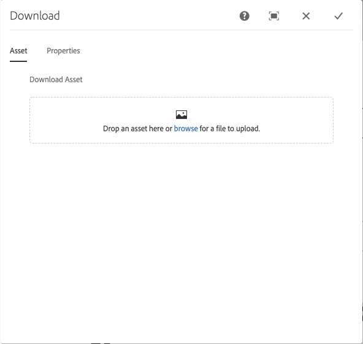

# Download Component{#download-component}

O componente de Download do componente principal permite a criação de uma opção de download em uma página.

## Uso {#usage}

O componente de Download do componente principal permite a inclusão de uma opção de download e o ativo associado em uma página.

* The download option&#39;s properties can be selected in the [configure dialog](#configure-dialog).
* Defaults for the download component can be defined in the [design dialog](#design-dialog).

## Version and Compatibility {#version-and-compatibility}

A versão atual do componente de download é v 1, que foi introduzida com a versão 2.5.0 dos Componentes principais em junho de 2019 e descrita neste documento.

A tabela a seguir detalha todas as versões compatíveis do componente, as versões AEM com as quais as versões do componente são compatíveis e links para a documentação das versões anteriores.

| Versão do componente | AEM 6.3 | AEM 6.4 | AEM 6.5 |
|--- |--- |--- |---|
| v1 | Compatível | Compatível | Compatível |

For more information about Core Component versions and releases, see the document [Core Components Versions](versions.md).

## Sample Component Output {#sample-component-output}

To experience the Download Component as well as see examples of its configuration options as well as HTML and JSON output, visit the [Component Library](http://opensource.adobe.com/aem-core-wcm-components/library/download.html).

## Technical Details {#technical-details}

The latest technical documentation about the Download Component [can be found on GitHub](https://github.com/adobe/aem-core-wcm-components/tree/master/content/src/content/jcr_root/apps/core/wcm/components/download/v1/download).

Further details about developing Core Components can be found in the [Core Components developer documentation](developing.md).

## Configure Dialog {#configure-dialog}

A caixa de diálogo Configurar permite que o autor do conteúdo defina o item de download e como ele se comportará e será exibido para um visitante da página.

### Asset Tab {#asset-tab}

The selection of a download asset is very similar to the functionality of the [Image Component](image.md) and likewise leverages AEM&#39;s DAM.

* **Baixar ativo**
   * Drop an asset from the [asset browser](https://helpx.adobe.com/experience-manager/6-5/sites/authoring/using/author-environment-tools.html) or tap the **browse** option to upload from a local file system.
   * Tap or click **Clear** to de-select the currently selected image.
   * Tap or click **Edit** to [mange the renditions of the asset](https://helpx.adobe.com/experience-manager/6-5/assets/using/managing-assets-touch-ui.html) in the asset editor.

### Properties Tab {#properties-tab}

* **Título** - exibe como um cabeçalho para o item de download
   * **Obter título do ativo DAM** - Quando selecionado, o título é automaticamente preenchido com o título do ativo DAM.
* **Descrição** - exibe como um subtítulo descritivo do item de download
   * **Obter descrição do ativo DAM** - Quando selecionado, a descrição é preenchida automaticamente com a descrição do ativo DAM.
* **Texto de ação** - Exibe como texto de ação para o item de download
   * Esse campo é necessário ao carregar um ativo do sistema de arquivos.
   * **Exibir em linha** - Quando selecionado o Texto **de ação fornecido** será exibido em linha.

## Design Dialog {#design-dialog}

A caixa de diálogo de design permite que o autor do modelo defina as opções disponíveis para o autor do conteúdo que usa o componente de download.

### Properties Tab {#properties-tab-design}

* **Texto de ação padrão** - define o texto **de ação padrão** fornecido quando um autor adiciona o componente de download a uma página.
* **Permitir carregar do sistema de arquivos** - permite que o autor do conteúdo faça upload de um ativo de seu arquivo local local como o ativo de download.
   * O valor padrão não está selecionado.
* **Tipo de título** - o elemento HTML usado para o título do componente de download.
   * Se nenhum valor for selecionado, o valor padrão será H 3.
* **Tamanho do arquivo de exibição** - Quando selecionado, o tamanho do arquivo do ativo será exibido no componente de download.
   * O valor padrão é selecionado.
* **Formato de arquivo de exibição** - Quando selecionado, o formato de arquivo do ativo será exibido no componente de download.
   * O valor padrão é selecionado.
* **Nome de arquivo** de exibição - Quando selecionado, o nome de arquivo do ativo será exibido no componente de download.
   * O valor padrão é selecionado.

### Styles Tab {#styles-tab}

The Image Component supports the AEM [Style System](authoring.md#component-styling).
