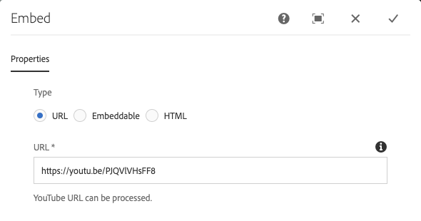
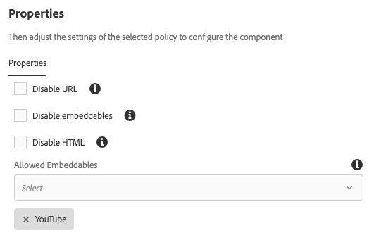

# Componente incorporado{#embed-component}

O componente incorporado dos componentes principais permite a incorporação de conteúdo externo em uma página de conteúdo do AEM.

## Uso {#usage}

O Componente principal incorporado permite que o autor do conteúdo defina o conteúdo externo selecionado para ser incorporado em uma página de conteúdo do AEM. Além disso, há uma opção para definir o HTML de forma livre a ser incorporado também.

* As propriedades do componente podem ser definidas na caixa de diálogo configurar.
* Os padrões do componente ao adicioná-lo a uma página podem ser definidos na caixa de diálogo de design.

## Versão e compatibilidade {#version-and-compatibility}

A versão atual do Componente incorporado é a v1, que foi introduzida com a versão 2.7.0 dos Componentes principais em setembro de 2019, e é descrita neste documento.

A tabela a seguir detalha todas as versões compatíveis do componente, as versões do AEM com as quais as versões do componente são compatíveis e os links para a documentação de versões anteriores.

| Versão do componente | AEM 6.3 | AEM 6.4 | AEM 6.5 |
|--- |--- |--- |---|
| v1 | Compatível | Compatível | Compatível |

Para obter mais informações sobre versões e versões dos Componentes principais, consulte o documento Versões [dos componentes](versions.md)principais.

## Exemplo de saída de componente {#sample-component-output}

Para experimentar o Componente incorporado e ver exemplos de suas opções de configuração, bem como a saída HTML e JSON, visite a Biblioteca [de](http://opensource.adobe.com/aem-core-wcm-components/library/embed.html)componentes.

## Detalhes técnicos {#technical-details}

A documentação técnica mais recente sobre o Componente incorporado [pode ser encontrada no GitHub](https://github.com/adobe/aem-core-wcm-components/tree/master/content/src/content/jcr_root/apps/core/wcm/components/embed/v1/embed).

Para obter mais detalhes sobre o desenvolvimento dos Componentes principais, consulte a documentação [do desenvolvedor dos Componentes](developing.md)principais.

## Configurar caixa de diálogo {#configure-dialog}

A caixa de diálogo de configuração permite que o autor do conteúdo defina o recurso externo a ser incorporado na página. Primeiro escolha qual tipo de recurso deve ser incorporado:

* [URL](#url)
* [Incorporável](#embeddable)
* [HTML](#html)

### URL {#url}

A incorporação mais simples é o URL. Basta colar o URL do recurso que deseja incorporar no campo **URL** . O componente tentará acessar o recurso e, se ele puder ser renderizado por um dos processadores, exibirá uma mensagem de confirmação abaixo do campo **URL** . Caso contrário, o campo será marcado com erro.

O Componente incorporado é fornecido com processadores para os seguintes tipos de recursos:

* Recursos compatíveis com o padrão [oEmbed](https://oembed.com/) , incluindo publicação do Facebook, Instagram, SoundCloud, Twitter e YouTube
* Pinterest

Os desenvolvedores podem adicionar outros processadores de URL, [seguindo a documentação do desenvolvedor do Componente incorporado.](https://github.com/adobe/aem-core-wcm-components/tree/master/content/src/content/jcr_root/apps/core/wcm/components/embed/v1/embed#extending-the-embed-component)

### Incorporável {#embeddable}

Os incorporados permitem mais personalização do recurso incorporado, que pode ser parametrizado e incluir informações adicionais. Um autor é capaz de selecionar entre os materiais incorporados confiáveis pré-configurados e o componente é fornecido com um anúncio pronto para uso no Youtube.

O campo **Incorporável** define o tipo de processador que você deseja usar. No caso do YouTube incorporável, é possível definir:

* **ID** de vídeo - a ID de vídeo exclusiva do YouTube do recurso que você deseja incorporar
* **Largura** - A largura do vídeo incorporado
* **Altura** - A altura do vídeo incorporado

Outros materiais incorporados ofereceriam campos semelhantes e podem ser definidos por um desenvolvedor, [seguindo a documentação do desenvolvedor do Componente incorporado.](https://github.com/adobe/aem-core-wcm-components/tree/master/content/src/content/jcr_root/apps/core/wcm/components/embed/v1/embed#extending-the-embed-component)

>[!NOTE]
>Os incorporados devem ser ativados no nível do modelo por meio da caixa de diálogo  Design para estarem disponíveis para o autor da página.

### HTML {#html}

Você pode adicionar HTML de forma livre à sua página usando o Componente incorporado.

>[!NOTE]
>Quaisquer tags não seguras, como scripts, serão filtradas do HTML inserido e não serão renderizadas na página resultante.

#### Segurança {#security}

A marcação HTML que o autor pode inserir é filtrada para fins de segurança, a fim de evitar ataques de script entre sites que poderiam, por exemplo, permitir que os autores ganhassem direitos administrativos.

Em geral, todos os scripts e `style` elementos, bem como todos os `on*` e `style` atributos, serão removidos da saída.

No entanto, as regras são mais complicadas do que isso, pois o Componente incorporado segue o conjunto de regras de filtragem global do AEM HTML AntiSami, que pode ser encontrado em `/libs/cq/xssprotection/config.xml`. Isso pode ser sobreposto para configuração específica do projeto por um desenvolvedor, se necessário.

>[!NOTE]
>Embora as regras AntiSamy possam ser configuradas sobrepondo-se `/libs/cq/xssprotection/config.xml`, essas alterações afetam todo o comportamento de HTL e JSP e não apenas o Componente principal incorporado.

## Caixa de diálogo Design {#design-dialog}

A caixa de diálogo de design permite que o autor do modelo defina as opções disponíveis para o autor do conteúdo que usa o componente incorporado e os padrões definidos ao colocar o componente incorporado.

* **Desativar URL** - Desativa a opção **URL** para o autor do conteúdo quando selecionada
* **Disable Embeddables (Desativar componentes** incorporados) - Desativa a opção **Embeddable (Incorporável)** para o autor do conteúdo quando selecionada, independentemente de quais processadores incorporáveis são permitidos.
* **Desativar HTML** - Desativa a opção **HTML** para o autor do conteúdo quando selecionada.
* **Incorporáveis** permitidos - Seleção múltipla que define quais processadores incorporáveis estão disponíveis para o autor do conteúdo, desde que a opção **Incorporável** esteja ativa.
