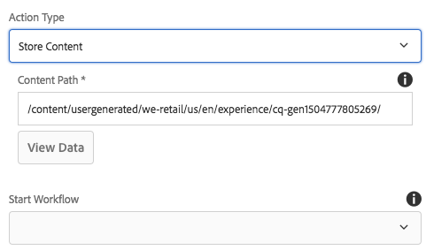

# Form Container Component (v1){#form-container-component-v}

O Componente principal do contêiner de formulário permite a criação de formulários simples de envio.

## Uso {#usage}

O Componente de contêiner de formulário ativou a criação de formulários e recursos simples de envio de informações ao suportar formulários WCM simples e ao usar uma estrutura aninhada para permitir componentes de formulário adicionais.

Usando a caixa de diálogo [de](form-container-v1.md#main-pars_title) configuração, o editor de conteúdo pode definir que tipo de ação o envio do formulário aciona, onde o conteúdo enviado deve ser armazenado e se um fluxo de trabalho deve ser acionado. O autor do modelo pode usar a caixa de diálogo [de](form-container-v1.md#main-pars_title_1995166862) design para definir os componentes de permissão e seus mapeamentos semelhantes à caixa de diálogo de design para o contêiner de layout [padrão no editor](https://helpx.adobe.com/experience-manager/6-4/sites/authoring/using/templates.html#main-pars_title_1754153843)de modelo.

## Versão e compatibilidade {#version-and-compatibility}

Este documento descreve a v1 do Componente do contêiner de formulário, originalmente introduzido com a versão 1.0.0 dos Componentes principais com o AEM 6.3.

A tabela a seguir lista a compatibilidade de v1 do Componente do contêiner de formulário.

| Versão do AEM | Componente do contêiner de formulário v1 |
|--- |--- |
| 6.3 | Compatível |
| 6.4 | Compatível |

>[!CAUTION]
>
>Este documento descreve a v1 do Componente de contêiner de formulário.
>
>Para obter detalhes sobre a versão atual do Componente do contêiner de formulário, consulte o documento Componente [do contêiner de](form-container.md) formulário.

## Caixa de diálogo Configurações {#settings-dialog}

A caixa de diálogo de configurações permite que o autor do conteúdo defina quais ações serão executadas quando o componente for enviado.

Dependendo do Tipo **de** ação selecionado, as opções disponíveis no contêiner serão alteradas. Os tipos de ação disponíveis são:

* [Email](form-container-v1.md#main-pars_title_966511656)
* [Armazenar conteúdo](form-container-v1.md#main-pars_title_2065985840)
* [Enviar pedido](form-container-v1.md#main-pars_title_686874527)
* [Atualizar pedido](form-container-v1.md#main-pars_title_410109286)

Independentemente do tipo, existem configurações  gerais que se aplicam a cada ação.

### Email {#mail}

Quando o formulário for enviado, o tipo de ação de email enviará um email aos destinatários designados.

* **Assunto** - O assunto do email que será enviado no envio do formulário
* **De** - O endereço de email de formulário do email que será enviado no envio do formulário
* **Para** - Os endereços dos destinatários que receberão um email após o envio do formulário
   * Toque ou clique no botão **Adicionar** para adicionar endereços adicionais
   * Toque ou clique no botão **Excluir** para remover um endereço de email
* **CC** - Os endereços dos destinatários que receberão uma cópia de carbono do e-mail enviado após o envio do formulário
   * Toque ou clique no botão **Adicionar** para adicionar endereços adicionais
   * Toque ou clique no botão **Excluir** para remover um endereço de email

### Armazenar conteúdo {#store-content}

Quando o formulário for enviado, o conteúdo do formulário será armazenado em um local de repositório designado.

* **Caminho** do conteúdo - Caminho do repositório do conteúdo onde o conteúdo enviado é armazenado
* **Exibir dados** - Toque ou clique para exibir os dados enviados armazenados como JSON
* **Iniciar fluxo de trabalho** - Configure para iniciar um fluxo de trabalho com o conteúdo armazenado como carga após o envio do formulário

### Enviar pedido {#submit-order}

Quando o formulário for submetido, a ordem será enviada.

### Atualizar pedido {#update-order}

Quando o formulário for enviado, o pedido será atualizado.

### Configurações gerais {#general-settings}

Independentemente do tipo de ação selecionado, uma página de agradecimento sempre pode ser definida.

O usuário será redirecionado para a página especificada após a conclusão do envio do formulário.

* Use a caixa de diálogo de seleção para selecionar um recurso no AEM.
* Se a página de agradecimento não estiver no AEM, especifique o URL absoluto. URLs não absolutos serão interpretados em relação ao AEM.
* Deixe em branco para exibir novamente o formulário após o envio.

## Caixa de diálogo Design {#design-dialog}

A caixa de diálogo de design permite que o autor do modelo defina os componentes permitidos e seus mapeamentos para o contêiner de forma semelhante à caixa de diálogo de design para o contêiner de layout [padrão no editor](https://helpx.adobe.com/experience-manager/6-4/sites/authoring/using/templates.html#main-pars_title_1754153843)de modelo.

## Detalhes técnicos {#technical-details}

A documentação técnica mais recente sobre o Componente do contêiner de formulário [pode ser encontrada no GitHub](https://github.com/adobe/aem-core-wcm-components/tree/master/content/src/content/jcr_root/apps/core/wcm/components/form/container/v1/container).

Todo o projeto de componentes principais pode ser baixado do GitHub.

Para obter mais detalhes sobre o desenvolvimento dos Componentes principais, consulte a documentação [do desenvolvedor dos Componentes](developing.md)principais.
