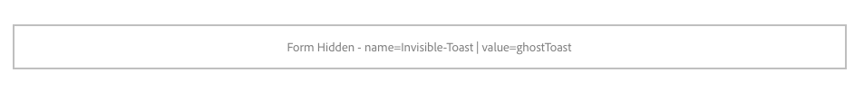

# Componente oculto do formulário{#form-hidden-component}

O componente de Formulário de componente principal permite a exibição de um campo oculto.

## Uso {#usage}

O componente oculto do formulário de componente principal permite que a criação de campos ocultos passe informações sobre a página atual de volta para o AEM e seja usada com o componente do contêiner [de formulário](form-container.md).

As propriedades de campo podem ser definidas pelo editor de conteúdo na caixa de diálogo [Configurar](form-hidden.md).

## Versão e compatibilidade {#version-and-compatibility}

A versão atual do componente oculto do formulário é v 2, que foi introduzida com a versão 2.0.0 dos componentes principais em janeiro de 2018 e descrita neste documento.

A tabela a seguir detalha todas as versões compatíveis do componente, as versões AEM com as quais as versões do componente são compatíveis e links para a documentação das versões anteriores.

| Versão do componente | AEM 6.3 | AEM 6.4 | AEM 6.5 |
|--- |--- |--- |--- |
| v2 | Compatível | Compatível | Compatível |
| [v1](form-hidden-v1.md) | Compatível | Compatível | Compatível |

Para obter mais informações sobre versões e versões do componente principal, consulte o documento [Principais versões de componentes](versions.md).

## Exemplo de saída do componente {#sample-component-output}

A amostra a seguir é coletada em [We. Retail](https://helpx.adobe.com/experience-manager/6-5/sites/developing/using/we-retail.html).

### HTML {#html}

```
<div class="cmp cmp-form aem-GridColumn aem-GridColumn--default--12">
 <form method="POST" action="/content/we-retail/us/en/experience.html" id="new_form" name="new_form" enctype="multipart/form-data" class="aem-Grid aem-Grid--12 aem-Grid--default--12 ">
  <input type="hidden" name=":formstart" value="/content/we-retail/us/en/experience/jcr:content/root/responsivegrid/container">
   <div class="visible aem-GridColumn aem-GridColumn--default--12">
    <input type="hidden" id="ghostToast" name="Invisible Toast" value="ghostToast">
   </div>
 </form>
</div>
```

### JSON {#json}

```
"container": {
              "columnClassNames": "aem-GridColumn aem-GridColumn--default--12",
              "columnCount": 12,
              "gridClassNames": "aem-Grid aem-Grid--12 aem-Grid--default--12",
              ":items": {
                "hidden": {
                  "columnClassNames": "aem-GridColumn aem-GridColumn--default--12",
                  ":type": "weretail/components/form/hidden",
                  "name": "Invisible Toast",
                  "id": "ghostToast",
                  "value": "ghostToast"
                }
              },
              ":itemsOrder": [
                "hidden"
              ],
              ":type": "weretail/components/form/container"
            }
```

### Detalhes técnicos {#technical-details}

A documentação técnica mais recente sobre o componente oculto do formulário [pode ser encontrada no github](https://github.com/adobe/aem-core-wcm-components/blob/master/content/src/content/jcr_root/apps/core/wcm/components/form/hidden/v2/hidden).

Detalhes adicionais sobre o desenvolvimento dos Componentes principais podem ser encontrados na documentação do desenvolvedor de Componentes [principais](developing.md).

## Configurar caixa de diálogo {#configure-dialog}

A caixa de diálogo Configurar permite que o autor do conteúdo defina os parâmetros do campo oculto.


* **Nomear**
o nome do campo, que é enviado com os dados do formulário
* **Valor**
O valor do campo, que é enviado com os dados do formulário
* **Identificador**
O identificador deve ser exclusivo na página e pode ser usado para vincular scripts a esse campo de formulário

Como o componente Formulário oculto normalmente não tem atributos visíveis, o espaço reservado do componente no editor exibe os **valores de campo Nome** e **Valor** se eles forem atribuídos para ajudar o autor a identificar o componente adequado do Formulário Oculto.



## Caixa de diálogo de design {#design-dialog}

Não há diálogo de design para o componente Formulário oculto.