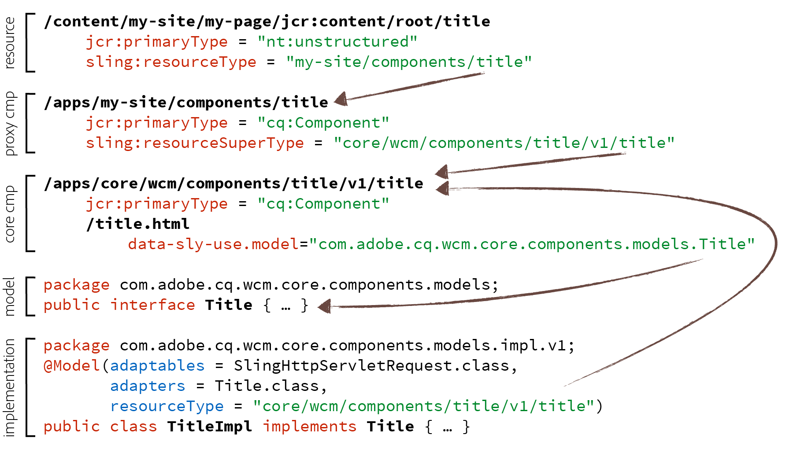

# Diretrizes de componentes {#component-guidelines}

Os Componentes [principais](developing.md) seguem padrões de implementação modernos que são muito diferentes dos componentes de fundação.

Essa página explica esses padrões e quando usá-los para criar seus próprios componentes criáveis. A primeira seção [Padrões de componente geral](guidelines.md) se aplica a qualquer tipo de componente, enquanto a segunda seção [Padrões de componentes reutilizáveis](guidelines.md) se aplica a componentes destinados a serem reutilizados em sites ou projetos, como Componentes principais por exemplo.

## Padrões gerais de componentes {#general-component-patterns}

As diretrizes nesta seção são recomendadas para qualquer tipo de componente, independentemente se o componente é específico a um único projeto ou se o componente deve ser amplamente reutilizado em sites ou projetos.

### Componentes configuráveis {#configurable-components}

Os componentes podem ter caixas de diálogo com diversas opções. Isso deve ser potencializado para tornar os componentes flexíveis e configuráveis, e evitar implementar vários componentes que são mais variações entre si.

Normalmente, se um wireframe ou design contiver variações de elementos similares, essas variações não deverão ser implementadas como componentes diferentes, mas como um componente com opções para escolher entre as variações.

Para fazer isso uma etapa ainda mais, se os componentes forem reutilizados em sites ou projetos, consulte a [seção Recursos](#pre-configurable-capabilities) pré-configuráveis.

### Separação de preocupações {#separation-of-concerns}

Manter a lógica (ou modelo) de um componente separado do modelo de marcação (ou exibição) geralmente é uma boa prática. Há várias maneiras de conseguir isso. Entretanto, o recomendado é usar Modelos [Sling](https://sling.apache.org/documentation/bundles/models.html) para a lógica e a Linguagem [HTML Template Language](https://helpx.adobe.com/experience-manager/htl/using/overview.html) (HTL) para a marcação, como os Componentes principais também.

Modelos Sling são um conjunto de anotações Java para acessar facilmente variáveis necessárias de pojos e, portanto, oferecem uma maneira simples, eficaz e performativa de implementar a lógica Java para componentes.

O HTL foi projetado para ser um idioma de modelo seguro e simples que é ajustado para o AEM. Ele pode chamar várias formas de lógica, o que torna bastante flexível.

## Padrões de componentes reutilizáveis {#reusable-component-patterns}

As diretrizes nesta seção também podem ser usadas para qualquer tipo de componente, mas elas fazem a maior parte dos componentes que devem ser reutilizados em sites ou projetos, como Componentes principais, por exemplo. Essas orientações podem, portanto, ser ignoradas para componentes que são usados apenas em um único site ou projeto.

### Recursos pré-configuráveis {#pre-configurable-capabilities}

Além da caixa de diálogo de edição usada pelos autores de páginas, os componentes também podem ter uma caixa de diálogo de design para os autores do modelo pré-configurá-los. O Editor [de modelos](https://helpx.adobe.com/experience-manager/6-5/sites/authoring/using/templates.html) permite configurar todas as pré-configurações, chamadas de «Políticas».

Para tornar os componentes como reutilizáveis, eles devem ser fornecidos com opções significativas para pré-configuração. Isso permitirá ativar ou desativar os recursos dos componentes para que correspondam às necessidades específicas de sites diferentes.

<!-- 

Comment Type: annotation
Last Modified By: ims-author-CE1E2CE451D1F0680A490D45@AdobeID
Last Modified Date: 2017-04-17T17:49:04.584-0400

Unclear how I can add my own capability toggle (for example, if i extend a component and want to toggle that extended functionality ... )

 -->

### Padrão do componente de proxy {#proxy-component-pattern}

Como cada recurso de conteúdo tem `sling:resourceType` uma propriedade que referencia o componente para renderizá-lo, geralmente é uma boa prática ter essas propriedades apontando para componentes específicos do site, em vez de apontar para componentes compartilhados por vários sites. Isso oferecerá mais flexibilidade e evite a atualização de conteúdo se um site precisar de um comportamento diferente para um componente, pois essa personalização pode ser alcançada no componente específico do site e não afetará os outros sites.

No entanto, para que os componentes específicos do projeto não duplicem qualquer código, eles devem se referir ao componente pai compartilhado com a `sling:resourceSuperType` propriedade. Esses componentes específicos do projeto que, principalmente, se referem aos componentes pai são chamados de &quot;componentes de proxy&quot;. Os componentes de proxy podem ser totalmente vazios se herdarem totalmente a funcionalidade, ou podem redefinir alguns aspectos do componente.

### Controle de versão do componente {#component-versioning}

Os componentes devem ser mantidos totalmente compatíveis com o tempo, mas algumas vezes as alterações que não podem ser mantidas compatíveis são necessárias. Uma solução para essas necessidades opostas é introduzir o controle de versão do componente adicionando um número em seu caminho de tipo de recurso e nos nomes de classe Java totalmente qualificados de suas implementações. Este número de versão representa uma versão importante, conforme definido pelas [diretrizes](https://semver.org/)de controle de versão semântica, que são aumentadas apenas para alterações que não são compatíveis com versões anteriores.

Alterações incompatíveis aos seguintes aspectos dos componentes resultarão em uma nova versão:

* Modelos Sling (seguindo diretrizes de controle de versão semântica)
* Scripts e modelos HTL
* HTML Markup and CSS Selup
* Representação JSON
* Caixas de diálogo

Para obter mais detalhes, consulte [o documento Políticas](https://github.com/adobe/aem-core-wcm-components/wiki/Versioning-Policies) de controle em github.

O controle de versão de componentes cria uma forma de contrato importante para atualizações, pois esclarece quando algo pode precisar ser refacalizado. Consulte também a seção [Compatibilidade de atualização de Personalizações](customizing.md#upgrade-compatibility-of-customizations), que explica quais considerações diferentes de personalizações exigem uma atualização.

Para evitar migrações de conteúdo dolorosas, é importante nunca apontar diretamente para componentes com versão de recursos de conteúdo. Como regra de miniatura, o `sling:resourceType` conteúdo não deve ter um número de versão nem atualizar os componentes para que o conteúdo seja refacado também. A melhor maneira de evitar isso é seguir o [Padrão de componentes de proxy](#proxy-component-pattern) descrito acima.

### Interfaces do modelo {#model-interfaces}

Esse padrão diz respeito à `data-sly-use` instrução HTL para apontar para uma interface Java, enquanto a implementação do Modelo de sling também se registra no tipo de recurso do componente.

Quando combinado com o Padrão de componente [de proxy](#proxy-component-pattern) descrito acima, esta forma de vínculo duplo oferece os seguintes pontos de extensão:

1. Um site pode redefinir a implementação de um Modelo de Sling registrando-o no tipo de recurso do componente de proxy, sem ter em mente o arquivo HTL, que ainda pode apontar para a interface.
1. Um site pode redefinir a marcação HTL de um componente, sem ter em mente sobre qual lógica de implementação deve apontar.

## Colocando tudo em conjunto {#putting-it-all-together}

Abaixo está uma visão geral da estrutura de vínculo de tipo de recurso inteira, assumindo o exemplo do componente principal de título. Ele ilustra como um componente de proxy específico do site permite resolver o controle de versão de componentes, a fim de evitar que o recurso de conteúdo contenha qualquer número de versão. Em seguida, mostra como o arquivo `title.html`[HTL](https://helpx.adobe.com/experience-manager/htl/using/overview.html) do componente usa a interface do modelo, enquanto a implementação é vinculada à versão específica do componente por meio [das anotações do Sling Model](https://sling.apache.org/documentation/bundles/models.html) .

Abaixo está outra visão geral, que não mostra os detalhes do POJO de implementação, mas revela como os [modelos e políticas associados](https://helpx.adobe.com/experience-manager/6-5/sites/developing/using/page-templates-editable.html) são referenciados.

A `cq:allowedTemplates` propriedade informa quais modelos podem ser usados para um site, e `cq:template` as informa para cada página que o modelo associado é. Cada modelo é feito das seguintes três partes:

* **estrutura**
Contém os recursos que serão forçados em cada página a serem presentes e que o autor da página não poderá excluir, como por exemplo, os componentes do cabeçalho e rodapé da página.
* **inicial**
Contém o conteúdo inicial que será duplicado na página quando ele for criado.
* **políticas**
contém para cada componente o mapeamento a uma política, que é a pré-configuração do componente. Esse mapeamento permite que as políticas sejam reutilizadas em modelos e, portanto, são gerenciadas centralmente.

**Ler em seguida:**

* [Usar componentes principais](using.md) - comece a usar componentes principais em seu próprio projeto.
* [Personalizar componentes principais](customizing.md) - para aprender como estilo e personalizar os componentes principais.
