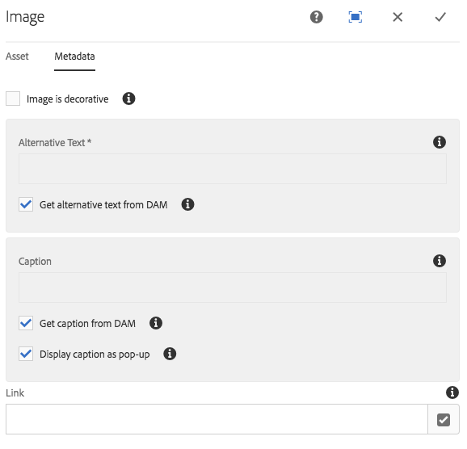
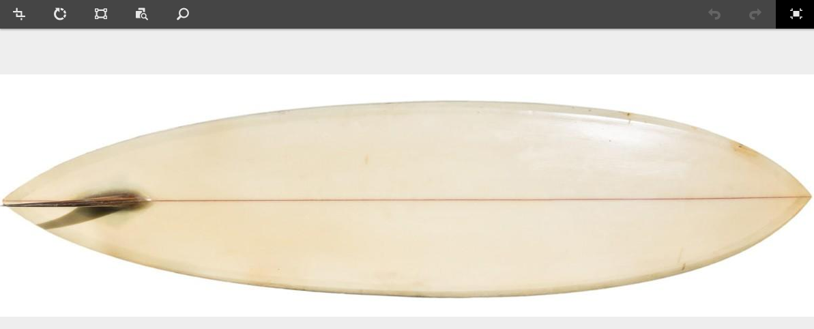
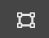
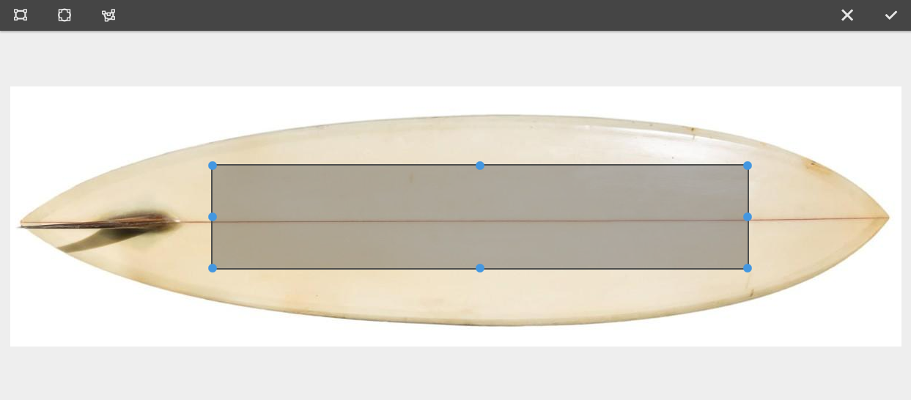

# Componente da imagem{#image-component}

O Componente de imagem do componente principal é um componente de imagem adaptativa que inclui a edição no local.

## Uso {#usage}

O componente de imagem apresenta uma seleção de imagem adaptativa e um comportamento responsivo com carregamento lento para o visitante da página, bem como um posicionamento de imagem fácil e recorte para o autor do conteúdo.

As larguras de imagem, bem como o recorte e as configurações adicionais, podem ser definidas pelo autor do modelo na caixa de diálogo [de design](#design-dialog). O editor de conteúdo pode carregar ou selecionar ativos na caixa de diálogo [Configurar](#configure-dialog) e recortar a imagem na caixa de diálogo [de edição](#edit-dialog). Para maior conveniência, a modificação simples no local da imagem também está disponível.

## Recursos responsivos {#responsive-features}

O Componente de imagem vem com recursos responsivos robustos prontos para fora da caixa. No nível de modelo de página, a [caixa](#design-dialog) de diálogo de design pode ser usada para definir as larguras padrão do ativo de imagem. O componente de imagem carregará automaticamente a largura correta para ser exibida dependendo do tamanho da janela do navegador. À medida que a janela é redimensionada, o componente Imaage carrega dinamicamente o tamanho da imagem correto dinamicamente. Não há necessidade de desenvolvedores de componentes se preocuparem com a definição de consultas de mídia personalizadas, pois o componente de imagem já está otimizado para carregar seu conteúdo.

Além disso, o componente de imagem suporta o carregamento lento para adiar o carregamento do ativo de imagem real até que esteja visível no navegador, aumentando a capacidade de resposta das suas páginas.

## Versão e compatibilidade {#version-and-compatibility}

A versão atual do Componente de imagem é v 2, que foi introduzida com a versão 2.0.0 dos Componentes principais em janeiro de 2018 e descrita neste documento.

A tabela a seguir detalha todas as versões compatíveis do componente, as versões AEM com as quais as versões do componente são compatíveis e links para a documentação das versões anteriores.

| Versão do componente | AEM 6.3 | AEM 6.4 | AEM 6.5 |
|--- |--- |--- |--- |
| v2 | Compatível | Compatível | Compatível |
| [v1](image-v1.md) | Compatível | Compatível | Compatível |

Para obter mais informações sobre versões e versões do componente principal, consulte o documento [Principais versões de componentes](versions.md).

## Suporte SVG {#svg-support}

O componente de imagem dimensionável (SVG) é compatível com o componente de imagem.

* Arrastar e soltar um ativo SVG do DAM e fazer upload de um upload de arquivo SVG de um sistema de arquivos local são compatíveis.
* O servlet de imagem adaptativa transmite o arquivo SVG original (transformações são ignoradas).
* Para uma imagem SVG, as "imagens inteligentes" e os "tamanhos inteligentes" são definidos como uma matriz vazia no modelo de imagem.

### Segurança {#security}

Por motivos de segurança, o SVG original nunca é chamado diretamente pelo Editor de imagens. É chamado ``. Isso impede que o navegador execute qualquer script incorporado no arquivo SVG.

>[!CAUTION]
>
>O suporte SVG requer a versão 2.1.0 dos Componentes principais ou superior, juntamente [com service pack 2](https://helpx.adobe.com/experience-manager/6-4/release-notes/sp-release-notes.html) para AEM 6.4 ou [posterior, para](https://helpx.adobe.com/experience-manager/6-3/release-notes/sp3-release-notes.html) oferecer suporte a [novos recursos do editor de imagens](https://helpx.adobe.com/experience-manager/6-4/sites/developing/using/image-editor.html) no AEM.

## Exemplo de saída do componente {#sample-component-output}

Para experimentar o Componente de imagem, bem como ver exemplos de suas opções de configuração, além de HTML e saída JSON, visite a Biblioteca [de componentes](http://opensource.adobe.com/aem-core-wcm-components/library/image.html).

### Detalhes técnicos {#technical-details}

A documentação técnica mais recente sobre o Componente de imagem [pode ser encontrada no github](https://github.com/adobe/aem-core-wcm-components/blob/master/content/src/content/jcr_root/apps/core/wcm/components/image/v2/image).

Detalhes adicionais sobre o desenvolvimento dos Componentes principais podem ser encontrados na documentação do desenvolvedor de Componentes [principais](developing.md).

>[!NOTE]
>
>A partir da versão Components .1.0 dos Componentes principais, o componente de imagem suporta [schema.org microdados](https://schema.org).

## Configurar caixa de diálogo {#configure-dialog}

Além da caixa de diálogo [de edição padrão](#edit-dialog) e [da caixa de diálogo de design](#design-dialog), o componente de imagem oferece uma caixa de diálogo de configuração em que a própria imagem é definida junto com a descrição e as propriedades básicas.

### Guia Ativo {#asset-tab}

* **Ativos da imagem**
   * Solte um ativo do navegador [de ativos](https://helpx.adobe.com/experience-manager/6-5/sites/authoring/using/author-environment-tools.html) ou toque na opção **Procurar** para fazer upload de um sistema de arquivos local.
   * Toque ou clique **em Limpar** para desmarcar a imagem selecionada no momento.
   * Toque ou clique **em Editar** para [editar as representações do ativo](https://helpx.adobe.com/experience-manager/6-5/assets/using/managing-assets-touch-ui.html) no editor de ativos.

### Guia Metadados {#metadata-tab}

* **A imagem é decorativa**
se a imagem deve ser ignorada pela tecnologia assistiva e, portanto, não requer um texto alternativo. Isso se aplica somente a imagens decorativas.
* **Alternativa** textuais Alternativa do significado ou da função da imagem, para leitores com deficiências visuais.
   * Obter texto alternativo do DAM - Quando marcado o texto alternativo da imagem será preenchido com o valor dos `dc:description` metadados no DAM.

* **Legenda**
Informações adicionais sobre a imagem, exibidas abaixo da imagem por padrão.
   * **Obtenha a legenda do DAM**
quando o texto da legenda da imagem for marcado com o valor dos `dc:title` metadados no DAM.
   * **Exibir legenda como pop-up**
Quando marcada, a legenda não será exibida abaixo da imagem, mas como um pop-up exibido por alguns navegadores ao passar o mouse sobre a imagem.

* **Link**
   * Vincule a imagem a outro recurso.
   * Use a caixa de diálogo de seleção para vincular a outro recurso do AEM.
   * Se não estiver vinculado a um recurso AEM, insira o URL absoluto. Urls sem uso serão interpretados em relação ao AEM.

## Edit Dialog {#edit-dialog}

A caixa de diálogo Editar permite que o autor do conteúdo recorte, modifique o mapa de inicialização e aumente o zoom da imagem.

* Iniciar cortar

   

   A seleção dessa opção abre um menu suspenso para proporções de corte predefinidas.

   * Escolha a opção Mão **livre** para definir seu próprio corte.
   * Escolha a opção **Remover cortar** para exibir o ativo original.
   Quando uma opção de corte for selecionada, use as alças azuis para dimensionar o recorte da imagem.

   

* Girar à direita

   

   Use essa opção para girar a imagem 90 ° à direita (no sentido horário).

* Virar horizontalmente

   

   Use essa opção para virar a imagem horizontalmente ou girar a imagem 180 ° ao longo do eixo y.

* Virar verticalmente

   

   Use essa opção para virar a imagem verticalmente ou girar a imagem 180 ° ao longo do eixo x.

* Launch Map

   >[!CAUTION]
   >
   >O recurso Launch Map requer a versão 2.1.0 dos Componentes principais ou superior, juntamente [com service pack 2](https://helpx.adobe.com/experience-manager/6-4/release-notes/sp-release-notes.html) para AEM 6.4 ou [posterior, para](https://helpx.adobe.com/experience-manager/6-3/release-notes/sp3-release-notes.html) oferecer suporte a [novos recursos do editor de imagens](https://helpx.adobe.com/experience-manager/6-4/sites/developing/using/image-editor.html) no AEM.

   

   Use essa opção para aplicar um mapa de inicialização à imagem. Selecionar essa opção abre uma nova janela que permite ao usuário selecionar a forma do mapa:

   * **Adicionar mapa retangular**
   * **Adicionar mapa circular**
   * **Adicionar mapa de polígono**
      * Por padrão, adiciona um mapa de triângulo. Clique duas vezes em uma linha da forma para adicionar uma nova alça de redimensionamento azul em um novo lado.
   Quando uma forma de mapa é selecionada, ela é sobreposta na imagem, permitindo o redimensionamento. Arraste e solte as alças de redimensionamento azul para ajustar a forma.

   

   Depois de dimensionar o mapa de inicialização, clique nele para abrir uma barra de ferramentas flutuante para definir o caminho do link.

   * **Caminho**
      * Use a opção Seletor de caminho para selecionar um caminho no AEM
      * Se o caminho não estiver no AEM, use o URL absoluto. Caminhos não absolutos serão interpretados em relação ao AEM.
   * **Texto**
alternativo Descrição alternativa do destino do caminho
   * **Target**
      * **Mesma guia**
      * **Nova guia**
      * **Quadro pai**
      * **Quadro superior**
   Toque ou clique na marca de seleção azul para salvar, o x preto a ser cancelado e a lixeira vermelha para excluir o mapa.

   

* Redefinir zoom

   

   Se a imagem já tiver sido ampliada, use essa opção para redefinir o nível de zoom.

* Abrir controle deslizante de zoom

   

   Use essa opção para exibir um controle deslizante para controlar o nível de zoom da imagem.

   

O editor local também pode ser usado para modificar a imagem. Devido a limitações de espaço, apenas as opções básicas estão disponíveis em linha. Para opções de edição completa, use o modo de tela cheia.

>[!NOTE]
>
>As operações de edição de imagem (cortar, virar, girar) não são compatíveis com imagens GIF. Todas as alterações feitas no modo de edição a gifs não serão mantidas.

## Caixa de diálogo de design {#design-dialog}

A caixa de diálogo de design permite que o autor do modelo defina o recorte, o upload e a rotação e as opções de upload que o autor do conteúdo possui ao usar este componente.

### Guia Principal {#main-tab}

Na guia **Principal** , é possível definir uma lista de larguras em pixels para a imagem e o componente carregará automaticamente a largura mais apropriada com base no tamanho do navegador. Essa é uma parte importante dos recursos [responsivos](#responsive-features) do Componente de imagem.

Além disso, você pode definir quais opções de componente gerais são automaticamente ou desativadas quando o autor adiciona o componente a uma página.

* **Ativar carregamento
lento** Define se a opção de carregamento lazy é ativada automaticamente ao adicionar o componente de imagem a uma página.
* **Imagem Decorativa**
Define se a opção de imagem decorativa é ativada automaticamente ao adicionar o componente de imagem a uma página.
* **Obter texto alternativo do DAM**
define se a opção para recuperar o texto alternativo do DAM é ativada automaticamente ao adicionar o componente de imagem a uma página.
* **Obter legenda do DAM**
define se a opção para recuperar a legenda do DAM é ativada automaticamente ao adicionar o componente de imagem a uma página.
* **Exibir legenda como pop-up**
Define se a opção para exibir a legenda da imagem como um pop-up é ativada automaticamente ao adicionar o componente de imagem a uma página.
* **Desative a Verificação de rastreamento**
de UUID para desativar o rastreamento do UUID do ativo de imagem.

* **Larguras**
define uma lista de larguras em pixels para a imagem e o componente carrega automaticamente a largura mais apropriada com base no tamanho do navegador.
   * Toque ou clique no botão **Adicionar** para adicionar outro tamanho.
      * Use as alças de captura para reorganizar a ordem dos tamanhos.
      * Use o ícone **Excluir** para remover uma largura.
   * Por padrão, as imagens que carregam são adiadas até serem visíveis.
      * Selecione a opção **Desativar carregamento lento** para carregar as imagens ao carregar a página.
* **Qualidade
JPEG** O fator de qualidade (em porcentagem de 0 e 100) para transformações transformadas (por exemplo, imagens JPEG redimensionadas ou cortadas).

>[!CAUTION]
>
>A opção Qualidade JPEG está disponível a partir da versão 2.2.0 dos Componentes principais.

>[!NOTE]
>
>A partir da versão 2.2.0 dos Componentes principais, o componente de imagem adiciona o atributo UUID exclusivo `data-asset-id` ao ativo de imagem para permitir o rastreamento e a análise do número de visualizações que cada ativo individual recebe.

### Guia Recursos {#features-tab}

Na guia **Recursos** , você pode definir quais opções estão disponíveis para os autores de conteúdo ao usar o componente, incluindo opções de upload, orientação e recorte.

* Origem

   

   Selecione a opção **Permitir upload de ativos do sistema de arquivos** para permitir que os autores de conteúdo façam upload de imagens de seu computador local. Para forçar os autores de conteúdo a selecionar apenas ativos do AEM, desmarque essa opção.

* Orientação

   

* **Girar**
Use esta opção para permitir que o autor do conteúdo use a **opção Girar à direita** .
* **Virar**
Use esta opção para permitir que o autor do conteúdo use as opções **Virar horizontalmente** e **Virar verticalmente** .

   >[!CAUTION]
   >
   >A opção **Virar** está desativada por padrão. Ativar exibirá os botões **Virar verticalmente** e **Virar horizontalmente** na janela de edição do componente de imagem, no entanto, o recurso não é suportado no momento pelo AEM e quaisquer alterações feitas usando essas opções não serão mantidas.

<!-- 
Comment Type: remark
Last Modified By: Chris Bohnert (bohnert)
Last Modified Date: 2017-11-20T05:51:34.378-0500

Added caution based on CQDOC-11457. Hid the flip options in the procedure using the <strong>Draft</strong> option so that when this feature is implemented in CQ-4221539, the <strong>Draft</strong> property can simply be removed along with the caution.

 -->

* Cortar

   

   Selecione a opção **Permitir corte** para permitir que o autor do conteúdo recorte a imagem no componente na janela de edição.
   * Clique **em Adicionar** para adicionar uma proporção de corte predefinido.
   * Digite um nome descritivo, que será mostrado na lista suspensa **Iniciar corte** .
   * Insira a proporção numérica do aspecto.
   * Use as alças de arrastar para reorganizar a ordem das proporções
   * Use o ícone de lixeira para excluir uma proporção.
   >[!CAUTION]
   >
   >Note that in AEM, crop aspect ratios are defined as **height/width**. Isso difere da definição convencional de largura/altura e é feita para os motivos de compatibilidade herdada. Os autores de conteúdo não estarão cientes de nenhuma diferença desde que forneça um nome claro da proporção, pois o nome é mostrado na interface do usuário, e não a proporção.

### Guia Estilos {#styles-tab-1}

O componente de imagem é compatível com o Sistema [de estilo AEM](authoring.md#component-styling).