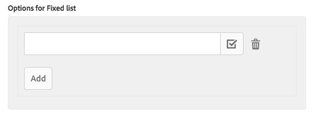

# Componente de lista (v 1){#list-component-v}

O Componente de lista de componentes principais permite a fácil criação de listas dinâmicas e estáticas.

## Uso {#usage}

O componente de lista pode ser usado para criar, por exemplo, uma lista dinâmica de páginas filhas ou uma lista estática de itens arbitrários.

O tipo de lista disponível e as opções de formatação podem ser definidas pelo autor do modelo na caixa de diálogo [de design](list-v1.md#main-pars_title_1995166862). O editor de conteúdo pode selecionar entre tipos de lista disponíveis e como formatar os elementos da lista na janela de [edição](list-v1.md#main-pars_title).

## Versão e compatibilidade {#version-and-compatibility}

Este documento descreve v 1 do componente de lista, originalmente introduzido com a versão 1.0.0 dos Componentes principais com o AEM 6.3.

A tabela a seguir lista a compatibilidade da v 1 do Componente de lista.

| Versão do AEM | Componente da lista v 1 |
|--- |--- |
| 6.3 | Compatível |
| 6.4 | Compatível |

>[!CAUTION]
>
>Este documento descreve v 1 do componente de lista.
>
>Para obter detalhes sobre a versão atual do Componente de lista, consulte o [documento Componente](list.md) de lista.

## Exemplo de saída do componente {#sample-component-output}

A amostra a seguir é coletada em [We. Retail](https://helpx.adobe.com/experience-manager/6-4/sites/developing/using/we-retail.html).

### Captura de tela {#screenshot}


### HTML {#html}

```
<div class="cmp cmp-list aem-GridColumn aem-GridColumn--default--12">

<ul>
    <li>
    <article>
        <a href="/content/we-retail/us/en/experience/arctic-surfing-in-lofoten.html">
            <span class="cmp-list--item-title">Arctic Surfing In Lofoten</span>
            
        </a>
        
    </article>
</li>

    <li>
    <article>
        <a href="/content/we-retail/us/en/experience/summit-success-in-the-himalayas.html">
            <span class="cmp-list--item-title">Summit Success in the Himalayas</span>
            
        </a>
        
    </article>
</li>

    <li>
    <article>
        <a href="/content/we-retail/us/en/experience/climbing-on-kalymnos-island--greece.html">
            <span class="cmp-list--item-title">Climbing on Kalymnos Island, Greece</span>
            
        </a>
        
    </article>
</li>

    <li>
    <article>
        <a href="/content/we-retail/us/en/experience/running-at-the-great-wall-marathon.html">
            <span class="cmp-list--item-title">Running at the Great Wall Marathon</span>
            
        </a>
        
    </article>
</li>

    <li>
    <article>
        <a href="/content/we-retail/us/en/experience/skiing-deep-powder-in-siberia.html">
            <span class="cmp-list--item-title">Skiing deep powder in Siberia</span>
            
        </a>
        
    </article>
</li>

    <li>
    <article>
        <a href="/content/we-retail/us/en/experience/climbing-in-the-massif-du-mont-blanc.html">
            <span class="cmp-list--item-title">Climbing in the Massif du Mont Blanc</span>
            
        </a>
        
    </article>
</li>
</ul>

</div>
```

### JSON {#json}

```
"articles_list": {
              "columnClassNames": "aem-GridColumn aem-GridColumn--default--12",
              ":type": "weretail/components/content/articleslist",
              "tagsMatch": "any",
              "displayAs": "teaser",
              "feedEnabled": "true",
              "listFrom": "children",
              "limit": "0",
              "orderBy": "cq:lastModified",
              "pageMax": "0"
            }
```

>[!NOTE]
>
>A exportação JSON dos componentes principais requer a versão 1.1.0 dos Componentes principais. Consulte as [informações de compatibilidade para Componentes principais v 1](versions.md#main-pars_title_236368006) para obter mais informações.

## Editar caixa de diálogo {#edit-dialog}

A caixa de diálogo Editar permite que o autor do conteúdo configure a lista e os elementos da lista.

### Configurações da lista {#list-settings}

A lista pode ser criada de maneiras diferentes.

* [Páginas secundárias](list-v1.md#main-pars_title_1861279796)
* [Lista fixa](list-v1.md#main-pars_title_1227896889)
* [Pesquisar](list-v1.md#main-pars_title_1224003560)
* [Tags](list-v1.md#main-pars_title_700759533)

Independentemente de como a lista é construída, há Opções [de classificação](list-v1.md#main-pars_title_1568376452) que podem sempre ser configuradas.


Dependendo de como o autor do conteúdo decide criar a lista, as opções de configuração adicionais serão alteradas.

#### Páginas filhas {#child-pages}

A lista pode ser criada das páginas secundárias da página atual ou de outra página.


* **Página primário**
   * A página cujas páginas secundárias devem fazer a lista
   * Deixe em branco para usar a página atual
* **Profundidade secundária** - quantos níveis na hierarquia devem ser usados

#### Lista fixa {#fixed-list}

A lista pode ser criada usando uma lista fixa de itens.



Toque ou clique no **botão Adicionar** para inserir um novo item na lista.

* Digite o texto para o item na lista ou use a caixa de diálogo **de Seleção** para escolher um item do AEM.
* Use a alça de arrastar para reorganizar os itens na lista.
* Use o ícone de lixeira para excluir itens na lista.

#### Pesquisar {#search}

A lista pode ser criada usando os resultados da pesquisa de conteúdo AEM.


* **Consulta de pesquisa** - A sequência de caracteres para a qual uma pesquisa de texto completa será executada para gerar os elementos da lista
* **Pesquisar em** - Onde a pesquisa deve ser executada
   * Usar a caixa de diálogo **de seleção** para escolher o local no AEM
   * Usar a página atual se deixado em branco

#### Tags {#tags}

A lista pode ser criada usando páginas que correspondem a determinadas tags em um determinado local.


* **Página principal** - Onde a correspondência da tag deve ser iniciada
   * Usar a caixa de diálogo **de seleção** para escolher o local no AEM
   * Usar a página atual se deixado em branco
* **Tags** - Quais tags devem ser correspondidas
   * Usar a caixa de diálogo **Procurar** para selecionar as tags
* **Correspondência** - definir qual tipo de correspondência deve qualificar uma página a ser incluída na lista
   * **qualquer tag**
   * **todas as tags**

#### Opções de classificação {#sort-options}

Independentemente de como você escolher criar a lista, há algumas opções de classificação que podem ser sempre definidas.


* **Ordenar por** - como os elementos devem ser ordenados
   * **Título**
   * **Última data de modificação**
* **Ordem** de classificação - A ordem na qual os itens devem ser ordenados
   * **ascendente**
   * **descendente**
* **Máximo de itens** - Número máximo de itens exibidos na lista.
   * Deixe em branco para retornar todos os itens.

### Configurações do item {#item-settings}

Usando a **guia Configurações** do item, é possível configurar a formatação dos elementos da lista.


* **Itens do link Vincular itens**
à página correspondente
* **Mostrar descrição**
Exibir descrições do item do link
* **Mostrar data de modificação**Mostrar data
do item do link

## Caixa de diálogo de design {#design-dialog}

A caixa de diálogo de design permite que o autor do modelo defina quais tipos de listas devem ser permitidas aos autores de conteúdo, bem como as configurações de item disponíveis.

### Configurações da lista {#list-settings-1}

Na guia **Configurações** da lista, o formato de data pode ser definido, bem como que tipo de lista deve estar disponível no componente para os autores de conteúdo.


* **Formato de data** - Formato a ser usado para a exibição da última data de modificação
* **Desativar filhos** - Desativar o tipo de lista secundária no componente
* **Desativar estático** - Desativar o tipo de lista estática no componente
* **Desativar pesquisa** - Desativar o tipo de lista de pesquisa no componente
* **Desativar tags** - Desativar o tipo de lista de tags no componente

### Configurações do item {#item-settings-1}

Na guia **Configurações** do item, as opções de formatação para os elementos de lista individuais que devem estar disponíveis no componente para os autores de conteúdo podem ser definidas.


* **Itens do link** - Ativar a opção Itens do link na janela [de edição](list-v1.md#main-pars_title_550499279)
* **Mostrar descrições** - Ativar a opção Exibir descrições na janela [de edição](list-v1.md#main-pars_title_550499279)
* **Mostrar data** - Ativar a opção Mostrar data na janela [de edição](list-v1.md#main-pars_title_550499279)

## Detalhes técnicos {#technical-details}

A documentação técnica mais recente sobre o Componente de lista [pode ser encontrada no github](https://github.com/adobe/aem-core-wcm-components/tree/master/content/src/content/jcr_root/apps/core/wcm/components/list/v1/list).

Todo o projeto de componentes principais pode ser baixado de github.

Detalhes adicionais sobre o desenvolvimento dos Componentes principais podem ser encontrados na documentação do desenvolvedor de Componentes [principais](developing.md).
