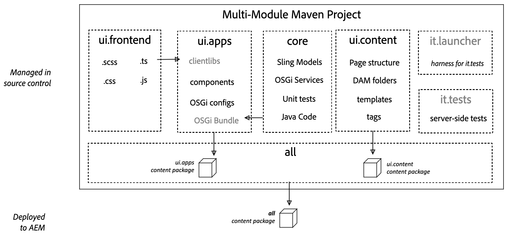

# Arquivo de projeto do AEM {#aem-project-archetype}

O AEM Project Archetype cria um projeto Adobe Experience Manager mínimo baseado em práticas recomendadas como ponto de partida para seus próprios projetos do AEM. As propriedades que devem ser fornecidas ao usar esse arquétipo permitem especificar os nomes de todas as partes deste projeto, bem como controlar determinados recursos opcionais.

>[!NOTE]
>
>O Arquivo de projeto do AEM mais recente e os detalhes técnicos completos [podem ser encontrados no GitHub](https://github.com/adobe/aem-project-archetype).

>[!NOTE]
>
>Consulte a [Introdução aos sites do AEM - Tutorial](https://docs.adobe.com/content/help/en/experience-manager-learn/getting-started-wknd-tutorial-develop/overview.html) WKND na documentação do AEM para obter um exemplo prático que o orienta a usar o arquétipo para implementar um projeto simples.

## Recursos {#features}

O arquétipo tem vários recursos que devem oferecer um ponto de partida conveniente para novos projetos do AEM:

* Páginas em inglês e francês com conteúdo de exemplo
* Um modelo de conteúdo baseado no recurso de modelo editável com política de conteúdo de exemplo
* Componente da página com base no componente principal da página do [AEM](page.md)
* Exemplos de componentes de conteúdo implementados com o padrão de proxy recomendado e um exemplo de componente personalizado do mundo de ajuda, todos baseados nos Componentes [principais do](introduction.md)AEM.
* Exemplos de componentes de [formulário](form-container.md)
* Configurações para emuladores de dispositivo, configuração de arrastar e soltar e internacionalização
* Bibliotecas clientes que seguem convenções de nomenclatura BEM, bem como estilos específicos do componente
* Pacotes de exemplos incluindo modelos de amostra, servelets, filtros e programadores
* Testes de unidade, integração e do cliente

## Por que usar o Archetype {#why-use-the-archetype}

Usar o AEM Project Archetype define você no caminho para a criação de um projeto AEM baseado em práticas recomendadas com apenas alguns pressionamentos de teclas. Ao usar o arquétipo, todas as partes já estarão no lugar para que, embora o projeto resultante seja mínimo, ele já implemente todos os recursos [](#features) principais do AEM para que tudo o que você precisa fazer seja desenvolver no topo e estender.

É claro que há muitos elementos que entram em um projeto do AEM bem-sucedido, mas usar o AEM Project Archetype é uma base sólida e é altamente recomendável para qualquer projeto do AEM.

## O que você obtém usando o Archetype {#what-you-get}

O AEM Archetype é composto de módulos:

* **[núcleo](core.md)**: é um pacote Java que contém todas as funcionalidades principais, como serviços OSGi, ouvintes e programadores, bem como código Java relacionado a componentes, como servlets e filtros de solicitação.
* **[ui.apps](uiapps.md)**: contém as `/apps` e `/etc` partes do projeto, ou seja, clientlibs JS e CSS, componentes, modelos, configurações específicas do modo de execução, bem como testes Hobbes.
* **[ui.content](uicontent.md)**: contém conteúdo de amostra usando os componentes do módulo ui.apps.
* **ui.testing**: é um pacote Java que contém testes JUnit executados no lado do servidor. Este pacote não deve ser implantado na produção.
* **ui.launch**: contém o código de cola que implanta o pacote ui.testing (e os pacotes dependentes) para o servidor e aciona a execução remota da JUnit.
* **[ui.front](uifrontend.md)**: **(opcional)** contém os artefatos necessários para usar o módulo de compilação front-end baseado no Webpack.



Os módulos do AEM Archetype representados no Maven são implantados no AEM como pacotes de conteúdo que representam o aplicativo, o conteúdo e os pacotes OSGi necessários.

## Requisitos {#requirements}

A versão atual do arquétipo tem os seguintes requisitos:

* Adobe Experience Manager 6.3.3.0 ou superior
* Apache Maven (3.3.9 ou mais recente)
* Repositório do Adobe Public Maven nas configurações do Maven. Consulte este artigo da [Base de conhecimento para obter detalhes](https://helpx.adobe.com/experience-manager/kb/SetUpTheAdobeMavenRepository.html).

Para obter uma lista das versões do AEM com suporte das versões anteriores do tipo de arquivo, consulte as versões [do AEM com suporte no](https://github.com/adobe/aem-project-archetype/blob/master/VERSIONS.md)histórico.

## Como usar o Archetype {#how-to-use-the-archetype}

Para usar o arquétipo, primeiro é necessário criar um projeto que gere os módulos em uma estrutura de arquivos local, conforme descrito [](#what-you-get)anteriormente. Como parte da geração do projeto, várias propriedades do projeto podem ser definidas, como nome do projeto, versão etc.

A construção do projeto com o Maven cria os artefatos (pacotes e pacotes OSGi), que podem ser implantados no AEM. Comandos e perfis Maven adicionais podem ser usados para implantar os artefatos do projeto em uma instância do AEM.

### Criação de um projeto {#create-project}

Para começar, você pode simplesmente usar a extensão [do](https://helpx.adobe.com/experience-manager/6-5/sites/developing/using/aem-eclipse.html) AEM Eclipse e seguir o assistente para Novo projeto e escolher Projeto **multimódulo de amostra do** AEM para usar uma versão lançada do arquétipo.

Claro que você também pode chamar Maven diretamente.

```
mvn archetype:generate \
 -DarchetypeGroupId=com.adobe.granite.archetypes \
 -DarchetypeArtifactId=aem-project-archetype \
 -DarchetypeVersion=XX
```

Onde `XX` está o número [da](https://github.com/adobe/aem-project-archetype/blob/master/VERSIONS.md) versão do AEM Project Archetype mais recente.

>[!NOTE]
>
>É prática recomendada adicionar o `adobe-public` perfil ao arquivo Maven `settings.xml` para adicionar automaticamente repo.adobe.com ao processo de compilação maven.
>
>Um exemplo de POM [pode ser encontrado aqui](https://helpx.adobe.com/experience-manager/kb/SetUpTheAdobeMavenRepository.html).

### Propriedades {#properties}

As seguintes propriedades estão disponíveis ao criar um projeto usando o arquétipo.

| Nome | Padrão | Descrição |
----------------------------|---------|--------------------
| `groupId` |  | Maven básico `groupId` |
| `artifactId` |  | Base Maven ArtiactualId |
| `version` |  | Versão |
| `package` |  | Pacote de origem Java |
| `appsFolderName` |  | `/apps` nome da pasta |
| `artifactName` |  | Nome do projeto Maven |
| `componentGroupName` |  | Nome do grupo de componentes AEM |
| `contentFolderName` |  | `/content` nome da pasta |
| `confFolderName` |  | `/conf` nome da pasta |
| `cssId` |  | prefixo usado em css gerado |
| `packageGroup` |  | Nome do grupo de pacotes de conteúdo |
| `siteName` |  | Nome do site AEM |
| `optionAemVersion` | 6.5.0 | Versão do Target AEM |
| `optionIncludeExamples` | y | Incluir um site de exemplo Biblioteca [de](http://opensource.adobe.com/aem-core-wcm-components/library.html) componentes |
| `optionIncludeErrorHandler` | n | Incluir uma página de resposta 404 personalizada |
| `optionIncludeFrontendModule` | n | [Incluir um módulo de front-end dedicado](uifrontend.md) |

>[!NOTE]
> Se o arquétipo for executado no modo interativo pela primeira vez, as propriedades com valores padrão não poderão ser alteradas (consulte [ARCHETYPE-308](https://issues.apache.org/jira/browse/ARCHETYPE-308) para obter mais detalhes). O valor pode ser alterado quando a confirmação de propriedade no final for negada e o questionário for repetido, ou transmitindo o parâmetro na linha de comando (por exemplo, `-DoptionIncludeExamples=n`).

### Perfis {#profiles}

O projeto maven gerado suporta diferentes perfis de implantação durante a execução `mvn install`.

| ID do perfil | Descrição |
--------------------------|------------------------------
| `autoInstallBundle` | Instala o pacote principal com o plug-in maven-sling-to-OSGi |
| `autoInstallPackage` | Instala o pacote de conteúdo ui.content e ui.apps com o content-package-maven-plugin para o gerenciador de pacotes na instância padrão do autor em localhost, porta 4502. O nome do host e a porta podem ser alterados com as propriedades `aem.host` e definidas pelo `aem.port` usuário. |
| `autoInstallPackagePublish` | Instale o pacote de conteúdo ui.content e ui.apps com o content-package-maven-plugin no gerenciador de pacotes para a instância de publicação padrão no localhost, porta 4503. O nome do host e a porta podem ser alterados com as propriedades `aem.host` e definidas pelo `aem.port` usuário. |
| `integrationTests` | Executa os testes de integração fornecidos na instância do AEM (somente para a `verify` fase) |

### Construção e instalação {#building-and-installing}

Para criar todos os módulos executados no diretório raiz do projeto, use o seguinte comando Maven.

```
mvn clean install
```

Se você tiver uma instância do AEM em execução, poderá criar e disponibilizar o projeto inteiro e implantá-lo no AEM com o seguinte comando Maven.

```
mvn clean install -PautoInstallPackage
```

Para implantá-lo em uma instância de publicação, execute este comando.

```
mvn clean install -PautoInstallPackagePublish
```

Como alternativa, para implantar em uma instância de publicação, execute este comando.

```
mvn clean install -PautoInstallPackage -Daem.port=4503
```

Ou para implantar somente o pacote no autor, execute este comando.

```
mvn clean install -PautoInstallBundle
```

## POM pai {#parent-pom}

A raiz `pom.xml` do projeto (`<src-directory>/<project>/pom.xml`) é conhecida como POM pai e direciona a estrutura do projeto, além de gerenciar dependências e determinadas propriedades globais do projeto.

### Propriedades do projeto global {#global-properties}

A `<properties>` seção do POM pai define várias propriedades globais que são importantes para a implantação de seu projeto em uma instância do AEM, como nome de usuário/senha, nome/porta do host etc.

Essas propriedades são configuradas para implantar em uma instância AEM local, pois essa é a compilação mais comum que os desenvolvedores farão. Observe que há propriedades para implantar em uma instância do autor, bem como em uma instância de publicação. Também é aqui que as credenciais são definidas para autenticação com a instância do AEM. As credenciais padrão admin:admin são usadas.

Essas propriedades são configuradas para que possam ser substituídas ao implantar em ambientes de nível superior. Dessa forma, os arquivos POM não precisam ser alterados, mas variáveis como `aem.host` e `sling.password` podem ser substituídas por argumentos de linha de comando:

````
mvn -PautoInstallPackage clean install -Daem.host=production.hostname -Dsling.password=productionpasswd
````

### Estrutura do módulo {#module-structure}

A `<modules>` seção do POM pai define os módulos que o projeto criará. Por padrão, o projeto cria [os módulos padrão previamente definidos](#what-you-get): core, ui.apps, ui.content, ui.testing e it.launch. Mais módulos sempre podem ser adicionados à medida que um projeto evolui.

### Dependências {#dependencies}

A `<dependencyManagement>` seção do POM pai define todas as dependências e versões de APIs usadas no projeto. As versões devem ser gerenciadas no POM pai. Submódulos como core e ui.apps não devem incluir informações sobre a versão.

#### Uber-Jar {#uber-jar}

Uma das principais dependências é o [AEM uber-jar](https://helpx.adobe.com/experience-manager/6-5/sites/developing/using/ht-projects-maven.html#ExperienceManagerAPIDependencies). Isso incluirá todas as APIs de AEM com apenas uma entrada de dependência para a versão do AEM.

>[!NOTE]
>
>Como prática recomendada, atualize a versão uber-jar para corresponder à versão de destino do AEM. Por exemplo, se você planeja implantar no AEM 6.4, atualize a versão do uber-jar para 6.4.0.

#### Componentes principais {#core-components}

O AEM Project Archetype, claro, aproveita os componentes principais.

Os Componentes principais são instalados automaticamente no AEM no modo de execução padrão e usados pelo site de amostra We.Retail. Em um modo de execução [de produção](https://helpx.adobe.com/experience-manager/6-5/sites/administering/using/production-ready.html) (`nosamplecontent`), os Componentes principais não estão disponíveis.

Portanto, para aproveitar os componentes principais em todas as implantações, é uma prática recomendada incluí-los como parte do projeto Maven.

>[!NOTE]
>
>Em geral, cada versão dos Componentes principais é seguida de uma versão do AEM Project Archetype para que o arquétipo mais recente use a versão mais recente dos componentes principais.
>
>Entretanto, uma nova versão do arquétipo pode não seguir diretamente uma nova versão dos Componentes principais, portanto, você pode atualizar a dependência dos Componentes principais para a versão mais recente.

>[!NOTE]
>
>Os principais.wcm.components.examples são um conjunto de páginas de amostra que ilustram exemplos dos Componentes principais. Como prática recomendada, ao implantar um projeto para uso de produção, você deve remover essa dependência e a inclusão do subpacote.

## Testes {#testing}

Há três níveis de testes contidos no projeto e, por serem diferentes tipos de testes, são executados de maneiras diferentes ou em lugares diferentes.

* Teste de unidade no núcleo: Isso mostra o teste de unidade clássica do código contido no pacote. Para testar, execute:
   * `mvn clean test`
* Testes de integração do servidor: Eles executam testes semelhantes a unidades no ambiente AEM, ou seja, no servidor AEM. Para testar, execute:
   * `mvn clean verify -PintegrationTests`
* Testes Hobbes.js do cliente: Esses são testes do lado do navegador baseados em JavaScript que verificam o comportamento do lado do navegador. Para testar:
   1. Carregue o AEM no seu navegador como faria para criar uma página.
   1. Abrir a página no modo [Desenvolvedor](https://helpx.adobe.com/experience-manager/6-5/sites/developing/using/developer-mode.html)
   1. Abra o painel esquerdo e alterne para a guia **Testes** .
   1. Encontre os testes **do** MyName gerados e execute-os.

## Próximas etapas {#next-steps}

Por isso, você criou e instalou o AEM Project Archetype. E agora? Bem, o arquétipo é pequeno, mas consiste em muitos exemplos de recursos avançados do AEM configurados de acordo com as práticas recomendadas. Use-os para indicar como você pode aproveitar esses recursos no seu projeto. Para qualquer projeto você provavelmente precisa:

* [Personalize componentes estendendo os componentes principais existentes](customizing.md)
* [Adicionar modelos adicionais](https://helpx.adobe.com/content/help/en/experience-manager/6-5/sites/authoring/using/templates.html)
* [Adaptar a estrutura de localização](https://helpx.adobe.com/experience-manager/6-5/sites/administering/using/tc-prep.html)
* [Saiba mais sobre o módulo de compilação front-end](uifrontend.md)
