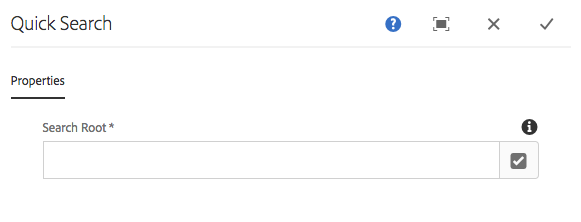
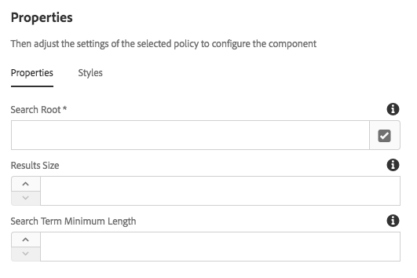

# Componente de pesquisa rápida{#quick-search-component}

O Componente de pesquisa rápida fornece recursos de pesquisa a um site e apresenta resultados de pesquisa para que os visitantes possam encontrar facilmente conteúdo correspondente e visualizar resultados.

## Uso {#usage}

O componente de Pesquisa rápida oferece aos visitantes do site a capacidade de pesquisar por conteúdo, visualizar os resultados no local e navegar facilmente para as páginas correspondentes. Novos resultados são obtidos dinamicamente à medida que o usuário rola os resultados da pesquisa.

A caixa de diálogo [de edição](#edit-dialog) permite que o autor do conteúdo defina onde na árvore de conteúdo a pesquisa deve ser iniciada. Usando a [caixa de diálogo de design](#design-dialog), o autor do modelo pode definir o valor padrão para onde na árvore de conteúdo a pesquisa deve começar, bem como um tamanho máximo de conjunto de resultados e o comprimento mínimo do termo de pesquisa.

## Versão e compatibilidade {#version-and-compatibility}

A versão atual do Componente de pesquisa rápida é v 1, que foi introduzida com a versão 2.0.0 dos Componentes principais em janeiro de 2018 e descrita neste documento.

A tabela a seguir detalha todas as versões compatíveis do componente, as versões AEM com as quais as versões do componente são compatíveis e links para a documentação das versões anteriores.

| Versão do componente | AEM 6.3 | AEM 6.4 | AEM 6.5 |
|--- |--- |--- |--- |
| v1 | Compatível | Compatível | Compatível |

Para obter mais informações sobre versões e versões do componente principal, consulte o documento [Principais versões de componentes](versions.md).

## Exemplo de saída do componente {#sample-component-output}

A amostra a seguir é coletada em [We. Retail](https://helpx.adobe.com/experience-manager/6-5/sites/developing/using/we-retail.html).

### Captura de tela {#screenshot}


### HTML {#html}

```
<section class="cmp-search" role="search" data-cmp-is="search" data-cmp-min-length="3" data-cmp-results-size="10">
    <form class="cmp-search__form" data-cmp-hook-search="form" method="get" action="/content/we-retail/us/en/equipment.searchresults.json/_jcr_content/root/responsivegrid/search" autocomplete="off">
        <div class="cmp-search__field">
            <i class="cmp-search__icon" data-cmp-hook-search="icon"></i>
            <span class="cmp-search__loading-indicator" data-cmp-hook-search="loadingIndicator"></span>
            <input class="cmp-search__input" data-cmp-hook-search="input" type="text" name="fulltext" placeholder="Search" role="combobox" aria-autocomplete="list" aria-haspopup="true" aria-invalid="false">
            <button class="cmp-search__clear" data-cmp-hook-search="clear">
                <i class="cmp-search__clear-icon"></i>
            </button>
        </div>
    </form>
    <div class="cmp-search__results" data-cmp-hook-search="results" role="listbox" aria-multiselectable="false"></div>
    
<script data-cmp-hook-search="itemTemplate" type="x-template">
    <a class="cmp-search__item" data-cmp-hook-search="item">
        <span class="cmp-search__item-title" data-cmp-hook-search="itemTitle"></span>
    </a>
</script>
</section>
```

### JSON {#json}

```
"search":{  
                     "columnClassNames":"aem-GridColumn aem-GridColumn--default--12",
                     "relativePath":"/jcr:content/root/responsivegrid/search",
                     "resultsSize":10,
                     "searchTermMinimumLength":3,
                     ":type":"core/wcm/components/search/v1/search"
                  }
```

### Detalhes técnicos {#technical-details}

>[!NOTE]
>
>A proteção do componente de pesquisa ou de qualquer aplicativo baseado em AEM contra ataques do DOS deve ser implementado em um nível superior, por exemplo, usando `mod_security` no dispatcher.

A documentação técnica mais recente sobre o Componente de pesquisa rápida [pode ser encontrada no github](https://github.com/adobe/aem-core-wcm-components/blob/master/content/src/content/jcr_root/apps/core/wcm/components/search/v1/search).

Detalhes adicionais sobre o desenvolvimento dos Componentes principais podem ser encontrados na documentação do desenvolvedor de Componentes [principais](developing.md).

## Editar caixa de diálogo {#edit-dialog}

A caixa de diálogo de edição permite que o autor do conteúdo defina onde na árvore de conteúdo a pesquisa deve ser iniciada.



**Raiz de pesquisa** - a página raiz de onde iniciar a pesquisa. A Raiz de pesquisa pode ser um blueprint mestre, um idioma principal ou uma página regular.

## Caixa de diálogo de design {#design-dialog}

Usando a caixa de diálogo de design, o autor do modelo pode definir o valor padrão para onde na árvore de conteúdo a pesquisa deve começar, bem como um tamanho máximo de conjunto de resultados e o comprimento mínimo do termo de pesquisa. A caixa de diálogo de design permite que o autor do modelo defina quais opções de formatação de texto estão disponíveis para os autores de conteúdo.

### Guia Propriedades {#properties-tab}



* **Raiz
de pesquisa** O valor padrão da raiz de pesquisa quando um autor de conteúdo posiciona o Componente de pesquisa rápida em uma página de conteúdo
* **Tamanho
dos resultados** O número máximo de resultados obtidos por uma solicitação de pesquisa
* **Comprimento mínimo do termo**de pesquisa do
termo de pesquisa do termo de pesquisa para iniciar a pesquisa

>[!NOTE]
>
>**Os Resultados de resultados** e **o Comprimento mínimo de pesquisa** podem ser definidos apenas no modo de design e, portanto, somente no nível do modelo, o que significa que os autores de conteúdo não podem modificar esses valores.

>[!CAUTION]
>
>**Os Resultados de resultados** e **o Comprimento mínimo do termo de pesquisa** podem ter impacto no desempenho se forem definidos muito alto ou muito baixo, respectivamente.

### Guia Estilos {#styles-tab}

O componente de pesquisa rápida é compatível com o Sistema [de estilo AEM](authoring.md#component-styling).