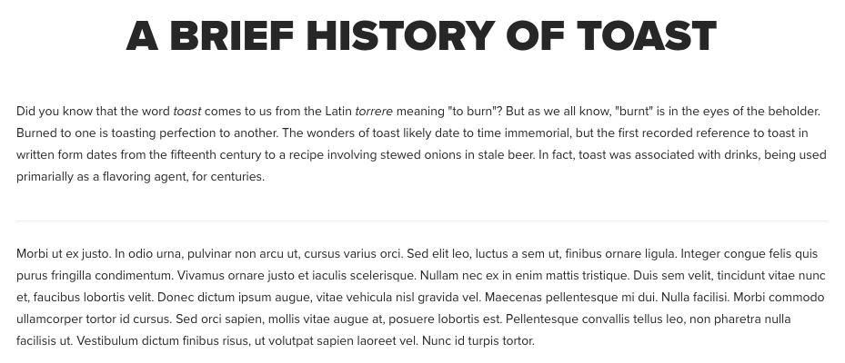

# Componente separador{#separator-component}

O componente do separador de componente principal exibe uma regra horizontal para separar o conteúdo.

## Uso {#usage}

O componente de separador permite que o autor do conteúdo crie facilmente uma regra horizontal como uma quebra entre o conteúdo para melhor organizar as informações em uma página.

## Versão e compatibilidade {#version-and-compatibility}

A versão atual do Componente Separador é v 1, que foi introduzida com a versão 2.3.0 dos Componentes principais em fevereiro de 2019 e descrita neste documento.

A tabela a seguir detalha todas as versões compatíveis do componente, as versões AEM com as quais as versões do componente são compatíveis e links para a documentação das versões anteriores.

| Versão do componente | AEM 6.3 | AEM 6.4 | AEM 6.5 |
|---|---|---|---|
| v1 | Compatível | Compatível | Compatível |

## Exemplo de saída do componente {#sample-component-output}

A seguir está uma amostra tirada de [We. Retail](https://helpx.adobe.com/experience-manager/6-5/sites/developing/using/we-retail.html).

### Captura de tela {#screenshot}

### Biblioteca de componentes

Para experimentar o Componente Separador, bem como ver exemplos de suas opções de configuração, bem como de HTML e saída JSON, visite a Biblioteca [de componentes](http://opensource.adobe.com/aem-core-wcm-components/library/separator.html).

### Detalhes técnicos {#technical-details}

A documentação técnica mais recente sobre o componente Separador [pode ser encontrada no github](https://github.com/adobe/aem-core-wcm-components/blob/master/content/src/content/jcr_root/apps/core/wcm/components/separator/v1/separator).

Detalhes adicionais sobre o desenvolvimento dos Componentes principais podem ser encontrados na documentação do desenvolvedor de Componentes [principais](developing.md).

## Configurar caixa de diálogo {#configure-dialog}

O componente do separador não tem uma caixa de diálogo de configuração.

## Caixa de diálogo de design {#design-dialog}

A caixa de diálogo de design permite que o autor do modelo defina os estilos aplicados ao Componente do separador.

### Guia Estilos {#styles-tab}

O Componente Separador é compatível com o Sistema [de estilo do AEM](authoring.md#component-styling).
