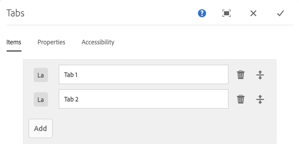

# Componente Tabulações

O Componente principal de guias de componentes permite a organização de conteúdo em várias guias.

## Uso {#usage}

O componente Guias permite que o autor do conteúdo organize o conteúdo da página em várias guias.

A caixa de diálogo [de](#edit-dialog) edição permite que o autor do conteúdo defina várias guias, bem como defina a guia ativa. Usando a caixa de diálogo [de](#design-dialog)design, o autor do modelo pode definir quais componentes podem ser adicionados às guias e personalizar os estilos.

>[!NOTE]
>
>Os componentes de guia aninhados (guias dentro de guias) são suportados.
>
>Componentes de guia simples (não aninhados) podem ser localizados/selecionados usando a árvore [de](https://helpx.adobe.com/experience-manager/6-5/sites/authoring/using/author-environment-tools.html)conteúdo, no entanto, guias aninhadas não podem ser.

## Versão e compatibilidade {#version-and-compatibility}

A versão atual do Componente de guias é v1, que foi introduzida com a versão 2.2.0 dos Componentes principais em outubro de 2018, e é descrita neste documento.

A tabela a seguir detalha todas as versões compatíveis do componente, as versões do AEM com as quais as versões do componente são compatíveis e os links para a documentação de versões anteriores.

| Versão do componente | AEM 6.3 | AEM 6.4 | AEM 6.5 |
|--- |--- |--- |--- |
| v1 | Compatível | Compatível | Compatível |

Para obter mais informações sobre versões e versões dos Componentes principais, consulte o documento Versões [dos componentes](versions.md)principais.

## Exemplo de saída de componente {#sample-component-output}

Para experimentar o componente Tabs e ver exemplos de suas opções de configuração, bem como a saída HTML e JSON, visite a Biblioteca [de](http://opensource.adobe.com/aem-core-wcm-components/library/tabs.html)componentes.

### Detalhes técnicos {#technical-details}

A documentação técnica mais recente sobre o componente Tabs [pode ser encontrada no GitHub](https://github.com/adobe/aem-core-wcm-components/blob/master/content/src/content/jcr_root/apps/core/wcm/components/tabs/v1/tabs).

Para obter mais detalhes sobre o desenvolvimento dos Componentes principais, consulte a documentação [do desenvolvedor dos Componentes](developing.md)principais.

## Edit Dialog {#edit-dialog}

A caixa de diálogo de edição permite que o autor do conteúdo crie, renomeie e reorganize guias, bem como defina a guia ativa.

### Guia Itens {#items-tab}

Use o botão **Adicionar** para abrir o seletor de componentes e escolher qual componente adicionar como guia. Depois de adicionada, uma entrada é adicionada à lista, que contém as seguintes colunas:

* **Ícone** - o ícone do tipo de componente da guia para facilitar a identificação na lista. Passe o mouse sobre o mouse para ver o nome completo do componente como uma dica de ferramenta.
* **Descrição** - A descrição usada como o texto da guia, padronizando com o nome do componente selecionado para a guia.
* **Excluir** - Toque ou clique para excluir a guia do componente de guia.
* **Reorganizar** - Toque ou clique e arraste para reorganizar a ordem das guias.

>[!TIP]
>
>Se o visor da página for reduzido para que a caixa de diálogo de edição se torne tela cheia, o botão **Adicionar** ficará oculto. Os componentes ainda podem ser adicionados ao Componente de guias ao [arrastar do navegador de componentes e soltar no Componente de guias no editor](https://helpx.adobe.com/experience-manager/6-5/sites/authoring/using/editing-content.html#InsertingaComponent)de páginas.

### Guia Propriedades {#properties-tab}

Na guia **Propriedades** , o autor do conteúdo pode definir qual guia está ativa quando a página é carregada. Com a opção **Padrão** , a primeira guia será selecionada.

### Guia Acessibilidade {#accessibility-tab}

Na guia **Acessibilidade** , os valores podem ser definidos para rótulos de acessibilidade  ARIA para o componente.

* **Rótulo** - Valor de um atributo de rótulo ARIA para o componente

## Select Panel {#select-panel}

O autor do conteúdo pode usar a opção **Selecionar painel** na barra de ferramentas do componente para mudar para um painel diferente para edição, bem como para reorganizar facilmente a ordem das guias.

Depois de selecionar a opção **Selecionar painel** na barra de ferramentas do componente, as guias configuradas são exibidas como uma lista suspensa.

* A lista é ordenada pela organização atribuída das guias e é refletida na numeração.
* O tipo de componente da guia é exibido primeiro, seguido pela descrição da guia em uma fonte mais leve.

* Tocar ou clicar em uma entrada na lista suspensa alterna a visualização no editor para essa guia.
* As guias podem ser reorganizadas no local usando as alças de arrastar.

>[!NOTE]
>
>As guias não podem ser selecionadas pelo autor quando estiverem no modo **Editar** . Use o modo [**Visualizar** ou a opção](https://helpx.adobe.com/experience-manager/6-5/sites/authoring/using/editing-content.html) Visualizar como publicado **** para interagir com as guias como um leitor do conteúdo publicado.

## Caixa de diálogo Design {#design-dialog}

A caixa de diálogo de design permite que o autor do modelo defina quais componentes podem ser adicionados como itens ao componente de guias, bem como defina quais estilos personalizados estão disponíveis para o autor do conteúdo.

### Guia Componentes permitidos {#allowed-components-tab}

A guia Componentes **** permitidos é usada para definir quais componentes podem ser adicionados como itens ao componente de guias pelo autor do conteúdo.

A guia Componentes permitidos funciona da mesma maneira que a guia do mesmo nome ao [definir a política e as propriedades de um Contêiner de layout no Editor de modelos.](https://helpx.adobe.com/experience-manager/6-5/sites/authoring/using/templates.html)

### Guia Estilos {#styles-tab}

O componente Tabs suporta o AEM [Style System](authoring.md#component-styling).
