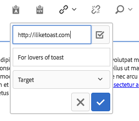
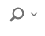
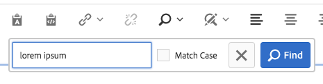
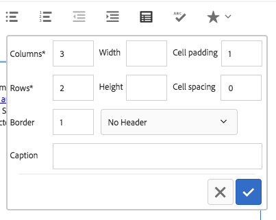

# Componente de texto (v1){#text-component-v}

O componente de texto é um componente de edição e composição de rich text que apresenta edição no local.

## Uso {#usage}

O componente de texto oferece um editor robusto de rich text que permite a fácil edição de texto em um editor simplificado e em linha, bem como um formato de tela cheia.

A caixa de diálogo [de](text-v1.md#main-pars_title) edição possui edição em linha com opções limitadas com funcionalidade total disponível na caixa de diálogo de edição em tela cheia. Usando a caixa de diálogo [de](text-v1.md#main-pars_title_1995166862)design, opções de formatação de texto, como cabeçalhos, caracteres especiais e estilos de parágrafo, podem ser configuradas para o modelo do autor do conteúdo.

## Versão e compatibilidade {#version-and-compatibility}

Este documento descreve a v1 do componente de texto, originalmente introduzido com a versão 1.0.0 dos Componentes principais com o AEM 6.3.

A tabela a seguir lista a compatibilidade de v1 do Componente de texto.

| Versão do AEM | Componente de texto v1 |
|--- |--- |
| 6.3 | Compatível |
| 6.4 | Compatível |

>[!CAUTION]
>
>Este documento descreve v1 do Componente de texto.
>
>Para obter detalhes sobre a versão atual do Componente de texto, consulte o documento Componente [de](text.md) texto.

## Exemplo de saída de componente {#sample-component-output}

A seguir está uma amostra retirada de [We.Retail](https://helpx.adobe.com/experience-manager/6-4/sites/developing/using/we-retail.html).

### Captura de tela {#screenshot}


### HTML {#html}

```
<div class="cmp cmp-text aem-GridColumn aem-GridColumn--default--12">
<p>Lorem ipsum dolor sit amet, consectetur adipiscing elit. Integer porttitor ante a tortor volutpat maximus. Donec eu porta eros. Aenean sit amet eleifend arcu, eu vestibulum magna. Fusce eget nisi tincidunt, tristique felis quis, tincidunt est. Aliquam consequat aliquam quam non eleifend. Phasellus ut magna luctus, aliquam risus eget, fermentum augue. Aliquam lobortis accumsan magna, quis efficitur enim dictum eu. Pellentesque iaculis felis eget felis commodo, non euismod dolor euismod. Quisque nec arcu rutrum, mollis tortor non, sollicitudin odio. Sed dictum nulla mauris, eu pretium dui vulputate a. Maecenas lacus massa, egestas vitae tincidunt eu, interdum et magna. Lorem ipsum dolor sit amet, consectetur adipiscing elit. In eleifend ex lacus, in consectetur nunc interdum et. Donec interdum mi vitae dolor pretium mattis. In quis arcu sapien. Phasellus at metus vitae nisi tincidunt varius.<br />
</p>
</div>
```

### JSON {#json}

```
"text": {
              "columnClassNames": "aem-GridColumn aem-GridColumn--default--12",
              "text": "<p>Lorem ipsum dolor sit amet, consectetur adipiscing elit. Integer porttitor ante a tortor volutpat maximus. Donec eu porta eros. Aenean sit amet eleifend arcu, eu vestibulum magna. Fusce eget nisi tincidunt, tristique felis quis, tincidunt est. Aliquam consequat aliquam quam non eleifend. Phasellus ut magna luctus, aliquam risus eget, fermentum augue. Aliquam lobortis accumsan magna, quis efficitur enim dictum eu. Pellentesque iaculis felis eget felis commodo, non euismod dolor euismod. Quisque nec arcu rutrum, mollis tortor non, sollicitudin odio. Sed dictum nulla mauris, eu pretium dui vulputate a. Maecenas lacus massa, egestas vitae tincidunt eu, interdum et magna. Lorem ipsum dolor sit amet, consectetur adipiscing elit. In eleifend ex lacus, in consectetur nunc interdum et. Donec interdum mi vitae dolor pretium mattis. In quis arcu sapien. Phasellus at metus vitae nisi tincidunt varius.</p>\n",
              "richText": true,
              ":type": "weretail/components/content/text"
            }
```

>[!NOTE]
>
>A exportação JSON dos Componentes principais exige a versão 1.1.0 dos Componentes principais. Consulte as informações de [compatibilidade dos Componentes principais v1](versions.md#main-pars_title_236368006) para obter mais informações.

## Edit Dialog {#edit-dialog}

A caixa de diálogo de edição oferece as ferramentas padrão de formatação Rich Text que um usuário esperaria compor texto.


* Negrito

   

   Usado para aplicar a formatação em negrito ao texto selecionado ou para formatar negrito o texto inserido após o cursor.

   **Ctrl+B** pode ser usado como um atalho do teclado.

* Itálico

   

   Usado para aplicar a formatação em itálico ao texto selecionado ou para colocar o texto em itálico inserido após o cursor.

   **Ctrl+I** pode ser usado como um atalho do teclado.

* Sublinhado

   

   Usado para aplicar a formatação sublinhada ao texto selecionado ou ao texto sublinhado inserido após o cursor.

   **Ctrl+U** pode ser usado como um atalho do teclado.

* Subscrito

   

   Usado para formatar texto ou texto selecionado inserido após o cursor como subscrito.

* Sobrescrito

   

   Usado para formatar o texto selecionado ou o texto inserido após o cursor como sobrescrito.

* Colar como texto

   

   Cola qualquer texto copiado como texto sem formatação.

   Ao selecionar essa opção, uma janela é aberta onde o texto pode ser colado como texto sem formatação como uma visualização antes de ser inserido no texto. Aceite tocando ou clicando na marca de seleção, cancele tocando ou clicando no x.

   

* Colar do Word

   

   Ao selecionar essa opção, uma janela é aberta onde o texto pode ser colado, mantendo sua formatação como uma visualização antes de ser inserido no texto. Aceite tocando ou clicando na marca de seleção, cancele tocando ou clicando no x.

   

* Hiperlink

   

   Use essa opção para converter o texto selecionado em um hiperlink ou modificar um link já definido. Essa opção só estará ativa quando o texto já estiver selecionado e abrir uma janela com opções adicionais para configurar o link.

   

   * Insira o local

      * Use a caixa de diálogo Abrir seleção para escolher um caminho no AEM
      * Se o link não estiver no AEM, insira o URL absoluto (os caminhos não absolutos são interpretados como relativos ao AEM)
   * Digite um texto descritivo alternativo para o link
   * Selecionar comportamento do link

      * Target
      * Mesma guia
      * Nova guia
      * Quadro pai
      * Quadro superior
   Toque ou clique na marca de seleção para aplicar o link ou o x para cancelar.

* Desvincular

   

   Use essa opção para remover um link já aplicado ao texto selecionado. Esta opção só está ativa quando um link já está selecionado.

* Localizar

   

   Use essa opção para pesquisar o texto por ocorrências de uma string de texto especificada. Selecionar essa opção abre uma janela para especificar as opções de pesquisa.

   

   Digite o texto para o qual deseja pesquisar e toque ou clique em **Localizar** para iniciar a pesquisa. Toque ou clique no x para cancelar.

   Se desejar fazer uma correspondência exata de acordo com o caso, selecione a opção **Corresponder caso** antes de iniciar a pesquisa.

   Se uma correspondência for encontrada, ela será realçada e a caixa de diálogo de pesquisa ficará esmaecida. Toque ou clique no botão **Localizar** novamente na caixa de diálogo esmaecida para procurar a próxima ocorrência.

   

   Se nenhuma ocorrência adicional for encontrada, uma mensagem será exibida e a pesquisa será reiniciada a partir do início do texto.

   

* Substituir

   

   Use essa opção para pesquisar o texto por ocorrências de uma string de texto especificada e substituir as correspondências por outra string. Selecionar essa opção abre uma janela para especificar as opções de pesquisa e substituição.

   

   Insira o texto para o qual deseja pesquisar, bem como o texto com o qual ele deve ser substituído.

   Toque ou clique em **Localizar** para iniciar a pesquisa. Clique ou toque no x para cancelar.

   Se desejar fazer uma correspondência exata de acordo com o caso, selecione a opção **Corresponder caso** antes de iniciar a pesquisa.

   Se uma correspondência for encontrada, ela será realçada e a caixa de diálogo de pesquisa ficará esmaecida. Clique novamente no botão **Localizar** na caixa de diálogo esmaecida para procurar a próxima ocorrência ou selecione o botão **Substituir** para substituir o texto destacado e correspondente. Observe que o botão **Substituir** está ativo somente quando uma correspondência é feita.

   Selecione **Substituir todas** para substituir todas as ocorrências do texto ao mesmo tempo.

* Alinhar texto à esquerda

   

   Usado para alinhar o texto à margem esquerda.

* Centralizar texto

   

   Usado para centralizar o texto.

* Alinhar texto à direita

   

   Usado para alinhar o texto à margem direita.

* Marcador

   

   Usado para formatar o texto selecionado como uma lista com marcadores ou iniciar a inserção de uma lista com marcadores após o cursor.

   Para encerrar uma lista com marcadores, toque ou clique no botão **Marcador** novamente ou insira duas retornos de carro.

* Numerado

   

   Usado para formatar o texto selecionado como uma lista numerada ou iniciar a inserção de uma lista numerada após o cursor.

   Para encerrar uma lista numerada, toque ou clique novamente no botão **Numerado** ou insira duas retornos de carro.

* Recuo para a esquerda

   

   Usado para diminuir o nível de recuo do texto ou texto selecionado inserido após o cursor.

   Somente ativo se o texto ou a posição do cursor selecionado já estiver recuado.

* Recuo

   

   Usado para aumentar o nível de recuo do texto ou texto selecionado inserido após o cursor.

* Tabela

   

   Usado para inserir uma tabela no texto. Selecionar essa opção abre uma janela para especificar os detalhes da tabela.

   

   * **Colunas** - O número de colunas da tabela (obrigatório)
   * **Linhas** - O número de linhas da tabela (obrigatório)
   * **Largura** - A largura da tabela
   * **Altura** - A altura da tabela
   * **Preenchimento** da célula - O espaço ao redor do conteúdo da célula
   * **Espaçamento entre células** - O espaço entre células
   * **Borda** - O peso das linhas de borda da tabela
   * Se for o cabeçalho da tabela:

      * A primeira linha deve ser usada
      * A primeira coluna deve ser usada
      * A primeira linha e a primeira coluna devem ser usadas
      * Ou nenhum cabeçalho deve ser usado.
   * **Legenda** - A legenda da tabela


* Verificar ortografia

   

   Usado para verificar a ortografia do conteúdo do texto. Possíveis erros ortográficos são sublinhados com linhas vermelhas quebradas.

* Caracteres especiais

   

   Usado para inserir caracteres especiais no texto. Selecionar essa opção abre uma janela onde os caracteres disponíveis são exibidos.

   

   Toque ou clique no caractere desejado para inseri-lo no texto após o cursor. Vários caracteres podem ser inseridos. Toque ou clique no x para fechar a janela de seleção.

* Editar origem

   

   Usado para exibir e modificar a fonte HTML do texto.

   Toque ou clique no ícone Editar **** fonte para alterar o conteúdo do texto da exibição formatada para exibir o HTML bruto. Neste modo, todas as outras opções de formatação estão desativadas. Toque ou clique novamente no ícone Editar **** fonte para retornar à exibição formatada.

   >[!CAUTION]
   >
   >Como sempre acontece com o acesso a HTML bruto, é necessário ter cuidado ao usar a opção Edição **de** origem!
   >
   >
   >O HTML inserido via Edição **** de origem é verificado para detecção de riscos XSS e todos os scripts inseridos são removidos e não aparecerão na página resultante. No entanto, o HTML mal formado inserido na Edição **de** origem pode quebrar o modelo da página, resultando em formatação inesperada ou na inutilização da página resultante.

* Formato de parágrafo

   

   Usado para aplicar a formatação de parágrafo ao texto selecionado ou ao texto inserido após o cursor. A seleção dessas opções abre uma lista suspensa na qual o formato de parágrafo é selecionado.

   

O componente de texto também pode ser editado em linha, mas devido a restrições de espaço, nem todas as opções de formatação estão disponíveis em linha. Para ver todas as opções, alterne para o modo de tela cheia.


## Caixa de diálogo Design {#design-dialog}

A caixa de diálogo de design permite que o autor do modelo defina quais opções de formatação de texto estão disponíveis para os autores do conteúdo.

### Recursos {#features}


Os seguintes recursos podem ser ativados ou desativados para o componente.

* Colar texto sem formatação
* Passado da palavra
* Localizar e substituir
* Verificador ortográfico
* Edição de origem

### Formatação {#formatting}


As seguintes opções de formatação podem ser ativadas ou desativadas para o componente.

* Tabela
* Listas
* Alinhamento
* Negrito, itálico, sublinhado
* Links
* Sub/sobrescrito

### Estilos de parágrafo {#paragraph-styles}


Os estilos de parágrafo podem ser ativados ou desativados para o componente. Quando ativados, os formatos permitidos podem ser definidos.

* Toque ou clique no botão **Adicionar** para inserir um novo estilo.
* Insira o código do estilo e uma descrição que será exibida na caixa de diálogo de edição.
* Para remover um toque de estilo ou clique no botão **Excluir** .
* Para reorganizar a ordem dos formatos, toque ou clique e arraste as alças.

### Caracteres especiais {#special-characters}


A opção para inserir caracteres especiais pode ser ativada ou desativada para o componente. Quando ativados, os caracteres permitidos podem ser definidos.

* Toque ou clique no botão **Adicionar** para inserir um novo caractere.
* Insira o código HTML do caractere e uma descrição que será exibida na caixa de diálogo de edição.
* Para remover um toque de caractere ou clique no botão **Excluir** .
* Para reorganizar a ordem dos caracteres, toque ou clique e arraste as alças.

## Detalhes técnicos {#technical-details}

A documentação técnica mais recente sobre o componente de texto [pode ser encontrada no GitHub](https://github.com/adobe/aem-core-wcm-components/tree/master/content/src/content/jcr_root/apps/core/wcm/components/text/v1/text).

Todo o projeto de componentes principais pode ser baixado do GitHub.

Para obter mais detalhes sobre o desenvolvimento dos Componentes principais, consulte a documentação [do desenvolvedor dos Componentes](developing.md)principais.
