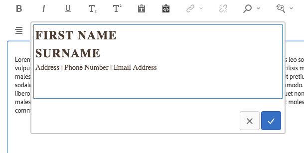
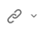
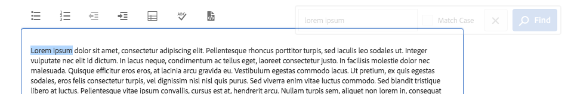
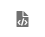
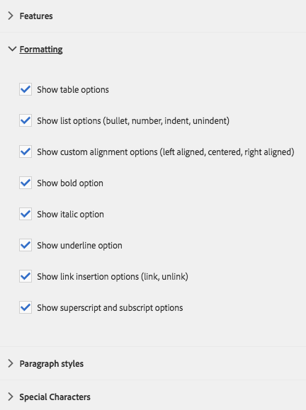

# Componente de texto{#text-component}

O Componente de texto principal é um componente de edição e composição de rich text que apresenta edição no local.

## Uso {#usage}

O componente de texto oferece um editor robusto de rich text que permite a fácil edição de texto em um editor simplificado e em linha, bem como um formato de tela cheia.

A caixa de diálogo [de](#edit-dialog) edição possui edição em linha com opções limitadas com funcionalidade total disponível na caixa de diálogo de edição em tela cheia. Usando a caixa de diálogo [de](#design-dialog)design, opções de formatação de texto, como cabeçalhos, caracteres especiais e estilos de parágrafo, podem ser configuradas para o modelo do autor do conteúdo.

## Versão e compatibilidade {#version-and-compatibility}

A versão atual do Componente de texto é a v2, que foi introduzida com a versão 2.0.0 dos Componentes principais em janeiro de 2018, e é descrita neste documento.

A tabela a seguir detalha todas as versões compatíveis do componente, as versões do AEM com as quais as versões do componente são compatíveis e os links para a documentação de versões anteriores.

| Versão do componente | AEM 6.3 | AEM 6.4 | AEM 6.5 |
|---|---|---|---|
| v2 | Compatível | Compatível | Compatível |
| [v1](text-v1.md) | Compatível | Compatível | Compatível |

Para obter mais informações sobre versões e versões dos Componentes principais, consulte o documento Versões [dos componentes](versions.md)principais.

## Exemplo de saída de componente {#sample-component-output}

Para experimentar o Componente de texto e ver exemplos de suas opções de configuração, bem como a saída HTML e JSON, visite a Biblioteca [de](http://opensource.adobe.com/aem-core-wcm-components/library/text.html)componentes.

### Detalhes técnicos {#technical-details}

A documentação técnica mais recente sobre o componente de texto [pode ser encontrada no GitHub](https://github.com/adobe/aem-core-wcm-components/blob/master/content/src/content/jcr_root/apps/core/wcm/components/text/v2/text).

Para obter mais detalhes sobre o desenvolvimento dos Componentes principais, consulte a documentação [do desenvolvedor dos Componentes](developing.md)principais.

## O componente de texto e o Editor de Rich Text {#the-text-component-and-the-rich-text-editor}

O Componente de texto dos componentes principais aproveita o Editor de Rich Text (RTE) do AEM. O RTE fornece aos autores de conteúdo uma ampla variedade de funcionalidades para editar seu conteúdo de texto. O RTE é muito flexível em sua configuração e oferece várias opções. Mais detalhes sobre como o RTE pode ser configurado podem ser encontrados nos artigos [Configurar o Editor](https://helpx.adobe.com/experience-manager/6-5/sites/administering/using/rich-text-editor.html) de Rich Text e [Configurar os plug-ins](https://helpx.adobe.com/experience-manager/6-5/sites/administering/using/configure-rich-text-editor-plug-ins.html)do Editor de Rich Text.

O restante deste artigo demonstra a configuração padrão do Componente de texto dos componentes principais com a configuração predefinida do ERT.

>[!NOTE]
>
>Somente as opções ativadas pelas configurações de [interface do RTE](https://chl-author-preview.corp.adobe.com/content/help/en/experience-manager/6-5/sites/administering/using/rich-text-editor.html) estão disponíveis no Componente de texto.

## Edit Dialog {#edit-dialog}

A caixa de diálogo de edição oferece as ferramentas padrão de formatação Rich Text que um usuário esperaria compor texto.

### Negrito

Usado para aplicar a formatação em negrito ao texto selecionado ou para formatar negrito o texto inserido após o cursor.

**Ctrl+B** pode ser usado como um atalho do teclado.

### Itálico

Usado para aplicar a formatação em itálico ao texto selecionado ou para colocar o texto em itálico inserido após o cursor.

**Ctrl+I** pode ser usado como um atalho do teclado.

### Sublinhado

Usado para aplicar a formatação sublinhada ao texto selecionado ou ao texto sublinhado inserido após o cursor.

**Ctrl+U** pode ser usado como um atalho do teclado.

### Subscrito

Usado para formatar texto ou texto selecionado inserido após o cursor como subscrito.

### Sobrescrito

Usado para formatar o texto selecionado ou o texto inserido após o cursor como sobrescrito.

### Colar como texto

Cola qualquer texto copiado como texto sem formatação.

Ao selecionar essa opção, uma janela é aberta onde o texto pode ser colado como texto sem formatação como uma visualização antes de ser inserido no texto. Aceite tocando ou clicando na marca de seleção, cancele tocando ou clicando no x.

### Colar do Word

Ao selecionar essa opção, uma janela é aberta onde o texto pode ser colado, mantendo sua formatação como uma visualização antes de ser inserido no texto. Aceite tocando ou clicando na marca de seleção, cancele tocando ou clicando no x.

### Hiperlink

Use essa opção para converter o texto selecionado em um hiperlink ou modificar um link já definido. Essa opção só estará ativa quando o texto já estiver selecionado e abrir uma janela com opções adicionais para configurar o link.

* Insira o local
   * Use a caixa de diálogo Abrir seleção para escolher um caminho no AEM
   * Se o link não estiver no AEM, insira o URL absoluto (os caminhos não absolutos são interpretados como relativos ao AEM)
* Digite um texto descritivo alternativo para o link
* Selecionar comportamento do link
   * Target
   * Mesma guia
   * Nova guia
   * Quadro pai
   * Quadro superior
   Toque ou clique na marca de seleção para aplicar o link ou o x para cancelar.

### Desvincular

Use essa opção para remover um link já aplicado ao texto selecionado. Esta opção só está ativa quando um link já está selecionado.

### Localizar

Use essa opção para pesquisar a ocorrência de uma string de texto especificada no texto. Selecionar essa opção abre uma janela para especificar as opções de pesquisa.

Digite o texto para o qual deseja pesquisar e toque ou clique em **Localizar** para iniciar a pesquisa. Toque ou clique no x para cancelar.
Se desejar fazer uma correspondência exata de acordo com o caso, selecione a opção **Corresponder caso** antes de iniciar a pesquisa.
Se uma correspondência for encontrada, ela será realçada e a caixa de diálogo de pesquisa ficará esmaecida. Toque ou clique no botão **Localizar** novamente na caixa de diálogo esmaecida para procurar a próxima ocorrência.

Se nenhuma ocorrência adicional for encontrada, uma mensagem será exibida e a pesquisa será reiniciada a partir do início do texto.

### Substituir

Use essa opção para pesquisar o texto por ocorrências de uma string de texto especificada e substituir as correspondências por outra string. Selecionar essa opção abre uma janela para especificar as opções de pesquisa e substituição.

Insira o texto para o qual deseja pesquisar, bem como o texto com o qual ele deve ser substituído.

Toque ou clique em **Localizar** para iniciar a pesquisa. Clique ou toque no x para cancelar.

Se desejar fazer uma correspondência exata de acordo com o caso, selecione a opção **Corresponder caso** antes de iniciar a pesquisa.

Se uma correspondência for encontrada, ela será realçada e a caixa de diálogo de pesquisa ficará esmaecida. Clique novamente no botão **Localizar** na caixa de diálogo esmaecida para procurar a próxima ocorrência ou selecione o botão **Substituir** para substituir o texto destacado e correspondente. Observe que o botão **Substituir** está ativo somente quando uma correspondência é feita.

Selecione **Substituir todas** para substituir todas as ocorrências do texto ao mesmo tempo.

### Alinhar texto à esquerda

Usado para alinhar o texto à margem esquerda.

### Centralizar texto

Usado para centralizar o texto.

### Alinhar texto à direita

Usado para alinhar o texto à margem direita.

### Marcador

Usado para formatar o texto selecionado como uma lista com marcadores ou iniciar a inserção de uma lista com marcadores após o cursor.

Para encerrar uma lista com marcadores, toque ou clique no botão **Marcador** novamente ou insira duas retornos de carro.

### Numerado

Usado para formatar o texto selecionado como uma lista numerada ou iniciar a inserção de uma lista numerada após o cursor.

Para encerrar uma lista numerada, toque ou clique novamente no botão **Numerado** ou insira duas retornos de carro.

### Recuo para a esquerda

Usado para diminuir o nível de recuo do texto ou texto selecionado inserido após o cursor.

Somente ativo se o texto ou a posição do cursor selecionado já estiver recuado.

### Recuo

Usado para aumentar o nível de recuo do texto ou texto selecionado inserido após o cursor.

### Tabela

Usado para inserir uma tabela no texto. Selecionar essa opção abre uma janela para especificar os detalhes da tabela.

* **Colunas** O número de colunas da tabela (obrigatório)
* **Linhas** O número de linhas da tabela (obrigatório)
* **Largura**
A largura da tabela
* **Altura**
A altura da tabela
* **Preenchimento** da célulaO espaço ao redor do conteúdo da célula
* **Espaçamento entre células** O espaço entre células
* **Borda** O peso das linhas de borda da tabela
* Se for o cabeçalho da tabela:
   * A primeira linha deve ser usada
   * A primeira coluna deve ser usada
   * A primeira linha e a primeira coluna devem ser usadas
   * Ou nenhum cabeçalho deve ser usado.
* **Legenda** A legenda da tabela

### Verificar ortografia

Usado para verificar a ortografia do conteúdo do texto. Possíveis erros ortográficos são sublinhados com linhas vermelhas quebradas.

Mais detalhes sobre verificação ortográfica e personalização de dicionários de verificação ortográfica podem ser encontrados no documento [Configurar os plug-ins](https://helpx.adobe.com/experience-manager/6-5/sites/administering/using/configure-rich-text-editor-plug-ins.html)do Editor de Rich Text.

### Caracteres especiais {#special-characters}

Usado para inserir caracteres especiais no texto. Selecionar essa opção abre uma janela onde os caracteres disponíveis são exibidos.

Toque ou clique no caractere desejado para inseri-lo no texto após o cursor. Vários caracteres podem ser inseridos. Toque ou clique no x para fechar a janela de seleção.

### Editar origem

Usado para exibir e modificar a fonte HTML do texto.

Toque ou clique no ícone Editar **** fonte para alterar o conteúdo do texto da exibição formatada para exibir o HTML bruto. Neste modo, todas as outras opções de formatação estão desativadas. Toque ou clique novamente no ícone Editar **** fonte para retornar à exibição formatada.

>[!CAUTION]
>
>Como sempre acontece com o acesso a HTML bruto, é necessário ter cuidado ao usar a opção Edição **de** origem!
>
>O HTML inserido via Edição **** de origem é verificado para detecção de riscos XSS e todos os scripts inseridos são removidos e não aparecerão na página resultante. No entanto, o HTML mal formado inserido na Edição **de** origem pode quebrar o modelo da página, resultando em formatação inesperada ou na inutilização da página resultante.

>[!NOTE]
>
>Como o HTML inserido via Edição **** de origem é verificado em busca de riscos XSS e qualquer script e remove automaticamente os encontrados, o conteúdo real persistido pode variar do que foi inserido na Edição **de** origem. Por isso, para salvar as alterações feitas usando a Edição **** de origem, é necessário sair primeiro da Edição **de** origem para exibir o texto no editor normal antes de salvar.

### Formato de parágrafo

Usado para aplicar a formatação de parágrafo ao texto selecionado ou ao texto inserido após o cursor. A seleção dessas opções abre uma lista suspensa na qual o formato de parágrafo é selecionado.

O componente de texto também pode ser editado em linha, mas devido a restrições de espaço, nem todas as opções de formatação estão disponíveis em linha. Para ver todas as opções, alterne para o modo de tela cheia.

## Caixa de diálogo Design {#design-dialog}

A caixa de diálogo de design permite que o autor do modelo defina quais opções de formatação de texto estão disponíveis para os autores do conteúdo.

### Guia Plug-ins {#plugins-tab}

A guia Plug-ins é usada para ativar e desativar várias opções de formatação de texto disponíveis para os autores de conteúdo.

### Recursos {#features}

Os seguintes recursos podem ser ativados ou desativados para o componente.

* Colar texto sem formatação
* Passado da palavra
* Localizar e substituir
* Verificador ortográfico
* Edição de origem

### Formatação {#formatting}

As seguintes opções de formatação podem ser ativadas ou desativadas para o componente.

* Tabela
* Listas
* Alinhamento
* Negrito, itálico, sublinhado
* Links
* Sub/sobrescrito

### Estilos de parágrafo {#paragraph-styles}

Os estilos de parágrafo podem ser ativados ou desativados para o componente. Quando ativados, os formatos permitidos podem ser definidos.

* Toque ou clique no botão **Adicionar** para inserir um novo estilo.
* Insira o código do estilo e uma descrição que será exibida na caixa de diálogo de edição.
* Para remover um toque de estilo ou clique no botão **Excluir** .
* Para reorganizar a ordem dos formatos, toque ou clique e arraste as alças.

### Configuração de caracteres especiais {#configuring-special-characters}

A opção para inserir caracteres especiais pode ser ativada ou desativada para o componente. Quando ativados, os caracteres permitidos podem ser definidos.

* Toque ou clique no botão **Adicionar** para inserir um novo caractere.
* Insira o código HTML do caractere e uma descrição que será exibida na caixa de diálogo de edição.
* Para remover um toque de caractere ou clique no botão **Excluir** .
* Para reorganizar a ordem dos caracteres, toque ou clique e arraste as alças.

## Guia Estilos {#styles-tab}

O componente de texto suporta o sistema [de](authoring.md#component-styling)estilo AEM.