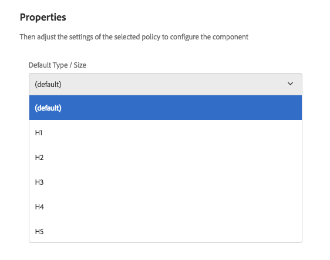

# Componente de título (v 1){#title-component-v}

O Componente de título do componente principal é um componente de cabeçalho de seção que inclui a edição no local.

## Uso {#usage}

O componente de título deve ser usado como título ou cabeçalho de uma seção do conteúdo.

Os níveis de cabeçalho disponíveis podem ser definidos pelo autor do modelo na caixa de diálogo [de design](title-v1.md#main-pars_title_1995166862). O editor de conteúdo pode selecionar os níveis de cabeçalhos disponíveis na caixa de diálogo [de edição](title-v1.md#main-pars_title). Para maior conveniência, a edição simples no local do cabeçalho também está disponível.

## Versão e compatibilidade {#version-and-compatibility}

Este documento descreve v 1 do componente de título, originalmente introduzido com a versão 1.0.0 dos Componentes principais com o AEM 6.3.

A tabela a seguir lista a compatibilidade da v 1 do Componente de título.

| Versão do AEM | Componente de título v 1 |
|--- |--- |
| 6.3 | Compatível |
| 6.4 | Compatível |

>[!CAUTION]
>
>Este documento descreve a versão 1 do componente de título.
>
>Para obter detalhes sobre a versão atual do Componente de título, consulte o [documento Componente](title.md) de título.

## Exemplo de saída do componente {#sample-component-output}

A amostra a seguir é coletada em [We. Retail](https://helpx.adobe.com/experience-manager/6-4/sites/developing/using/we-retail.html).

### Captura de tela {#screenshot}


### HTML {#html}

```
<div class="cmp cmp-title aem-GridColumn aem-GridColumn--default--12">
     <h2>Welcome! This is our finest equipment!</h2>
</div>
```

### JSON {#json}

```
"title": {
              "columnClassNames": "aem-GridColumn aem-GridColumn--default--12",
              ":type": "weretail/components/content/title",
              "jcr:title": "Welcome! This is our finest equipment!",
              "type": "h2"
            }
```

>[!NOTE]
>
>A exportação JSON dos componentes principais requer a versão 1.1.0 dos Componentes principais. Consulte as [informações de compatibilidade para Componentes principais v 1](versions.md#main-pars_title_236368006) para obter mais informações.

## Editar caixa de diálogo {#edit-dialog}

A caixa de diálogo Editar permite que o autor do conteúdo defina o texto do título e selecione o nível de cabeçalho.

>[!NOTE]
>
>Um valor vazio para o título fará com que o título da página seja exibido.


O editor local também pode ser usado para editar o texto do componente de título.


## Caixa de diálogo de design {#design-dialog}

A caixa de diálogo de design permite que o autor do modelo defina o nível de cabeçalho padrão que os componentes de título terão quando criados pelos autores de conteúdo.



## Detalhes técnicos {#technical-details}

A documentação técnica mais recente sobre o componente de título [pode ser encontrada no github](https://github.com/adobe/aem-core-wcm-components/tree/master/content/src/content/jcr_root/apps/core/wcm/components/title/v1/title).

Todo o projeto de componentes principais pode ser baixado de github.

Detalhes adicionais sobre o desenvolvimento dos Componentes principais podem ser encontrados na documentação do desenvolvedor de Componentes [principais](developing.md).
