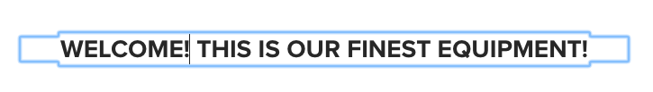

# Componente do título{#title-component}

O Componente principal de título do componente é um componente de cabeçalho de seção que apresenta edição no local.

## Uso {#usage}

O componente Título deve ser usado como título ou cabeçalho de uma seção de conteúdo. Os níveis de cabeçalho disponíveis podem ser definidos pelo autor do modelo na caixa de diálogo [de](#design-dialog)design. O editor de conteúdo pode selecionar entre os níveis de cabeçalho disponíveis na caixa de diálogo [de](#edit-dialog)edição. Para maior conveniência, a edição simples no local do texto do cabeçalho também está disponível.

## Versão e compatibilidade {#version-and-compatibility}

A versão atual do Componente de título é a v2, que foi introduzida com a versão 2.0.0 dos Componentes principais em janeiro de 2018, e é descrita neste documento.

A tabela a seguir detalha todas as versões compatíveis do componente, as versões do AEM com as quais as versões do componente são compatíveis e os links para a documentação de versões anteriores.

| Versão do componente | AEM 6.3 | AEM 6.4 | AEM 6.5 | AEM como um serviço em nuvem |
|---|---|---|---|---|
| v2 | Compatível | Compatível | Compatível | Compatível |
| [v1](title-v1.md) | Compatível | Compatível | Compatível | - |

Para obter mais informações sobre versões e versões dos Componentes principais, consulte o documento Versões [dos componentes](versions.md)principais.

## Exemplo de saída de componente {#sample-component-output}

Para experimentar o Componente de título e ver exemplos de suas opções de configuração, bem como a saída HTML e JSON, visite a Biblioteca [de](https://adobe.com/go/aem_cmp_library_title)componentes.

### Detalhes técnicos {#technical-details}

A documentação técnica mais recente sobre o componente Título [pode ser encontrada no GitHub](https://adobe.com/go/aem_cmp_tech_title_v2).

Para obter mais detalhes sobre o desenvolvimento dos Componentes principais, consulte a documentação [do desenvolvedor dos Componentes](developing.md)principais.

## Edit Dialog {#edit-dialog}

A caixa de diálogo de edição permite que o autor do conteúdo defina o texto do título e selecione o nível do cabeçalho.

* **Título** - se estiver vazio, o título da página será usado
* **Tipo/Tamanho** - Define o nível do cabeçalho do título
* **Link** - Define o conteúdo ao qual o título será vinculado. Pode ser um caminho para uma página de conteúdo, um URL externo ou uma âncora de página.

>[!CAUTION]
>
>A capacidade de definir um link para o título foi introduzida com a versão 2.2.0 dos Componentes principais.

O editor no local também pode ser usado para editar o texto do componente de título.

## Caixa de diálogo Design {#design-dialog}

A caixa de diálogo de design permite que o autor do modelo defina o nível de cabeçalho padrão que os componentes do título terão quando criados pelos autores do conteúdo.

### Guia Tamanhos {#sizes-tab}

* **Tipos / tamanhos permitidos para autores** - ative ou desative os tipos de cabeçalho que estarão disponíveis para autores de conteúdo quando usarem o componente Título.
* **Tipo/tamanho** padrão - Defina o tipo de cabeçalho que será atribuído automaticamente quando um autor de conteúdo adicionar o componente Título a uma página.
* **Desativar link**- desabilite o suporte para links no componente de título para impedir que autores de conteúdo vinculem de títulos.

>[!CAUTION]
>
>A capacidade de definir um link para o título foi introduzida com a versão 2.2.0 dos Componentes principais.

### Guia Estilos {#styles-tab}

O componente Título suporta o AEM [Style System](authoring.md#component-styling).
